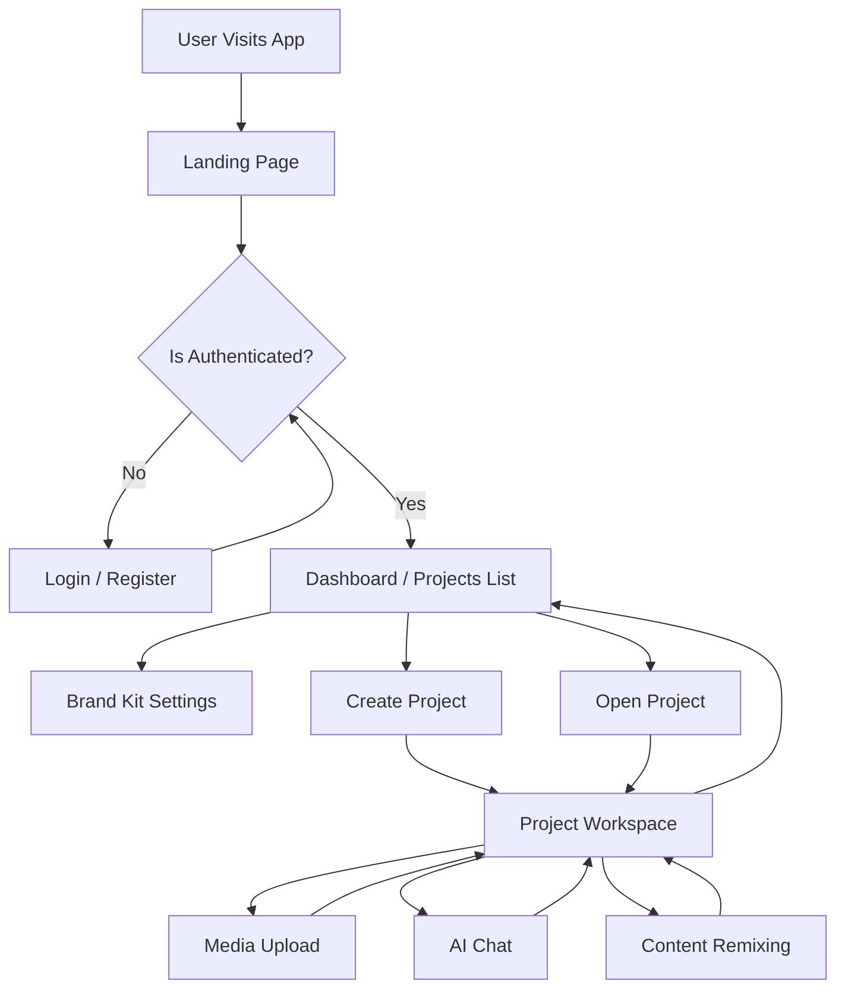
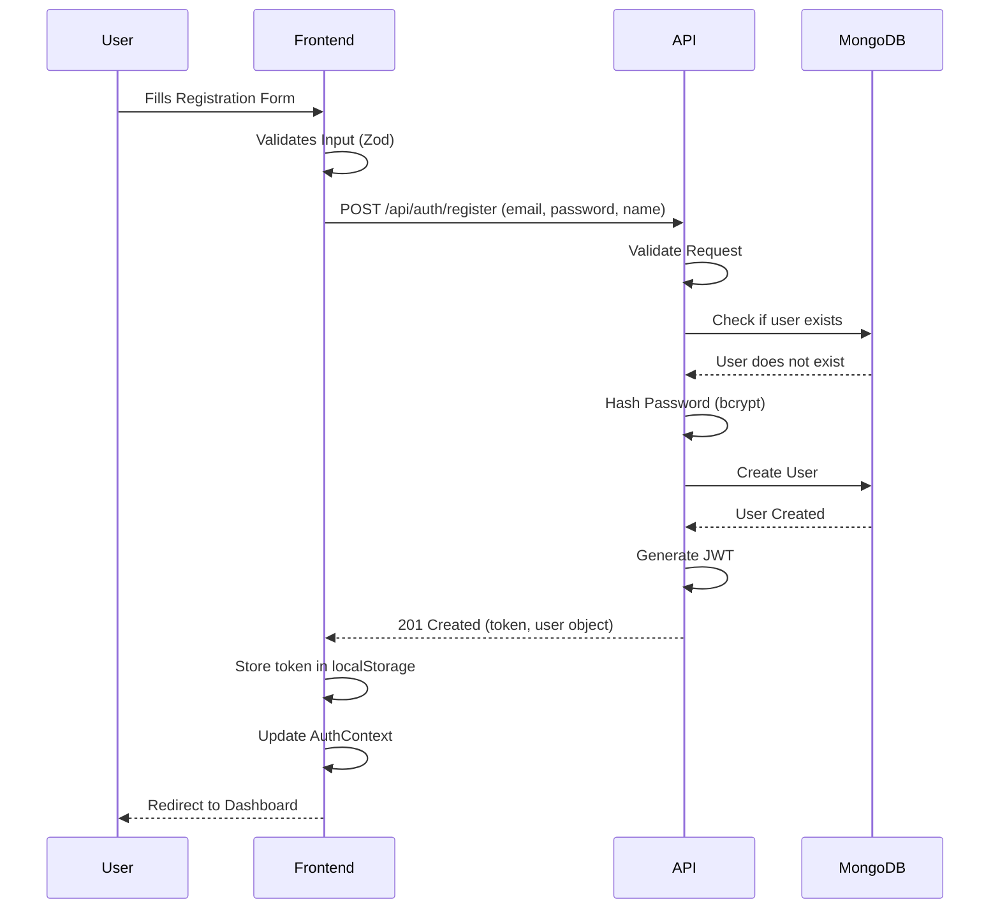
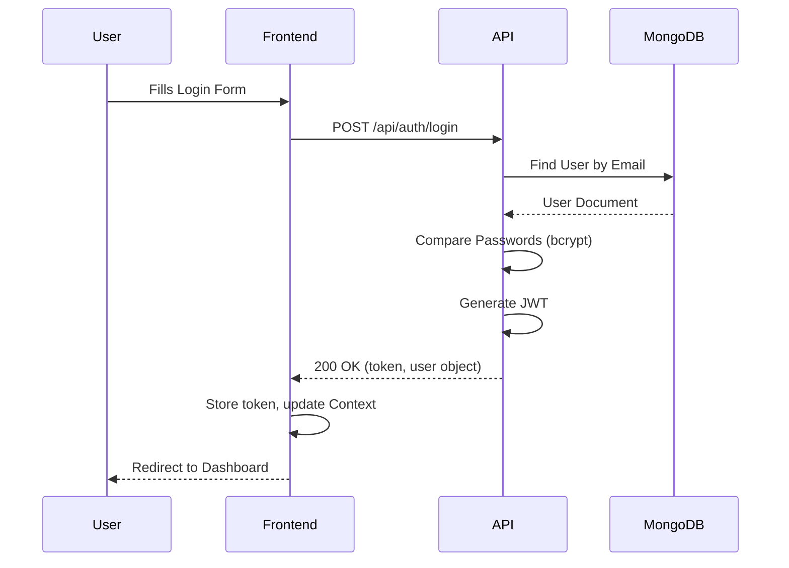
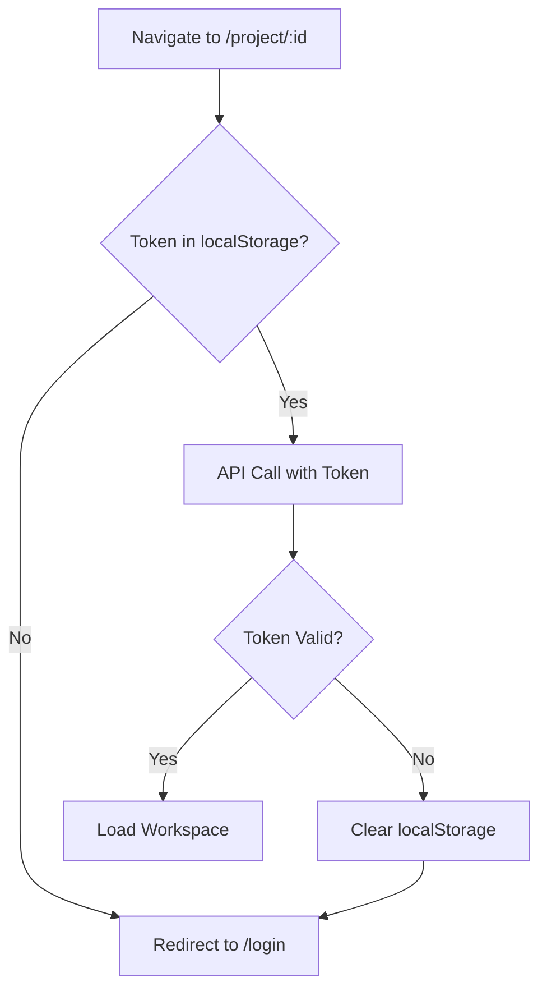
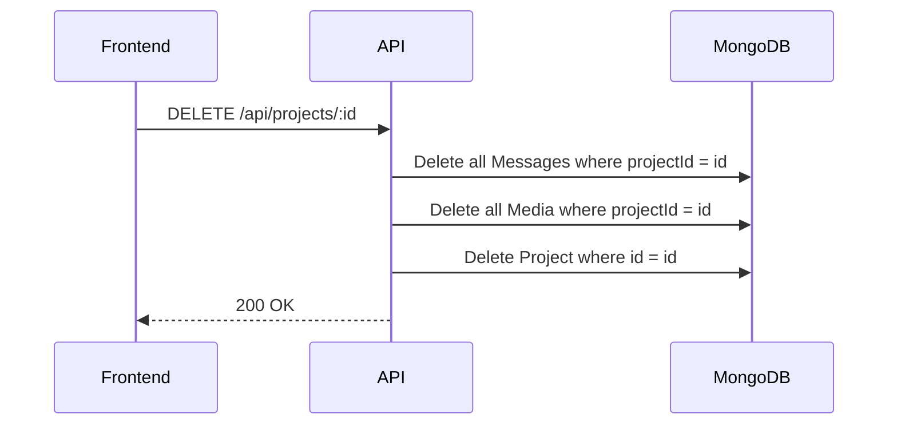
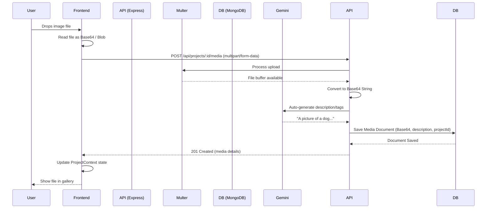
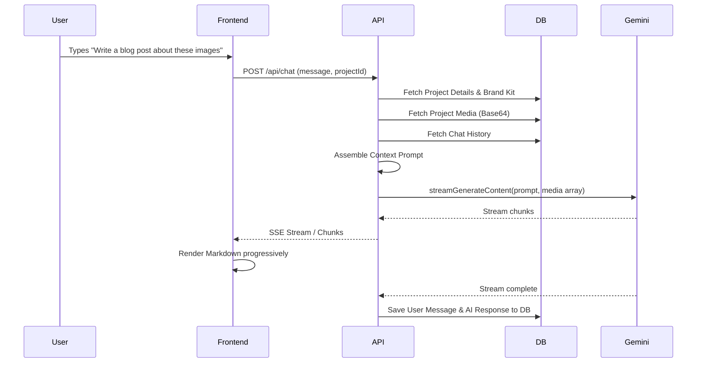
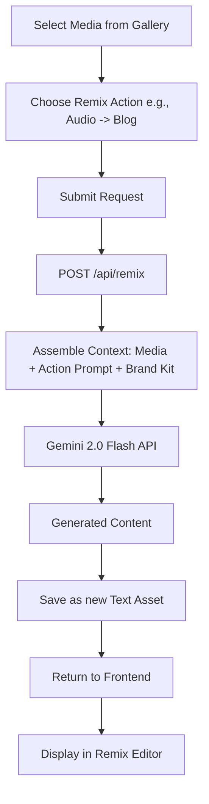
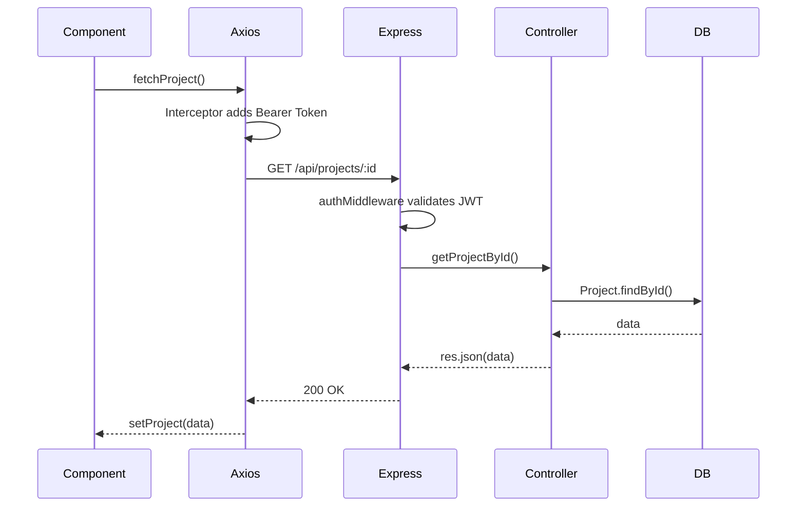
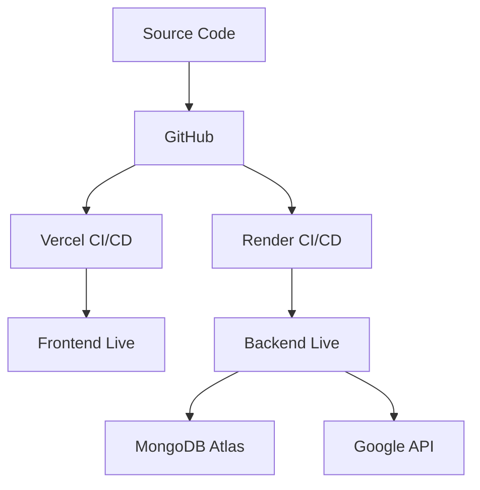

# CreatorForge Application Flow

This document details the application flows, data lifecycles, and interactions for CreatorForge.

## 1. Application Overview Flow



## 2. Authentication Flows

### Registration Flow



### Login Flow



### Protected Route Flow



## 3. Project Management Flows

### Create Project

1. User clicks "New Project" in Dashboard.
2. Frontend opens modal for project name/description.
3. User submits.
4. Frontend `POST /api/projects`.
5. API creates empty project in MongoDB, linked to User ID.
6. API returns `201 Created` with project ID.
7. Frontend routes to `/project/:id`.

### Delete Project



## 4. Media Upload Flow

### Single File Upload



## 5. AI Chat Flow



## 6. Content Remixing Flow



## 7. Brand Kit Flow
- User uploads brand colors, tone of voice guidelines, logo.
- Stored in User Document.
- Automatically prepended to Gemini system instructions: `You are an AI assistant. Follow these brand guidelines: {toneOfVoice}`.

## 8. Data Flow Diagrams



## 9. Page Navigation Flow

```mermaid
flowchart LR
    Root[/] --> Login[/login]
    Root --> Register[/register]
    Root --> Dashboard[/dashboard] (Protected)
    Dashboard --> Settings[/settings/brandkit] (Protected)
    Dashboard --> Workspace[/project/:id] (Protected)
```

## 10. Edge Case Flows
- **Token Expiry**: Axios interceptor catches 401, clears localStorage, redirects to `/login`.
- **Large File**: Multer rejects file > 10MB, API sends 413 Payload Too Large, frontend shows Toast error.
- **Gemini Timeout**: API wraps Gemini call in timeout promise. On fail, returns 503 Service Unavailable.

## 11. Deployment Flow


