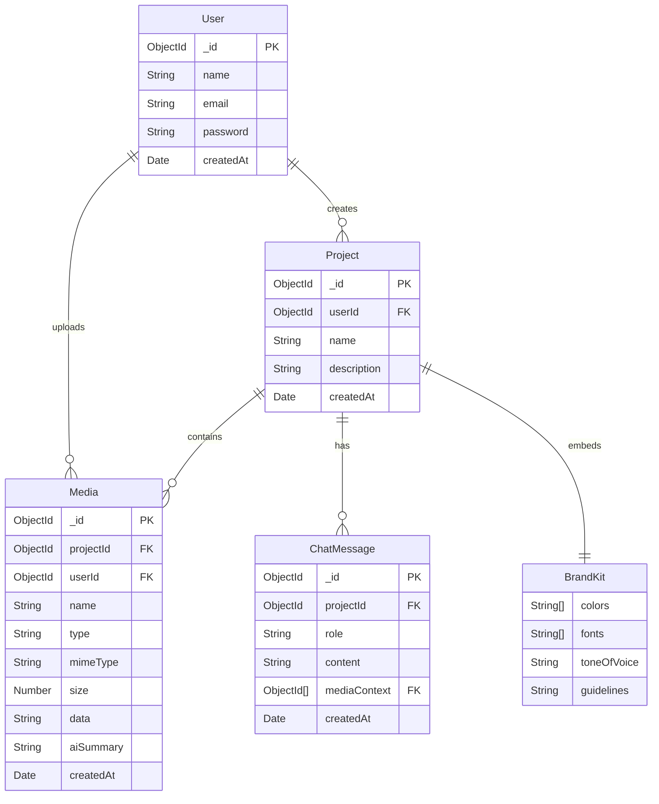

> Historical planning document. For the implemented routes, limits, configured Gemini model, and deployment contract, see [LIVE_BACKEND.md](LIVE_BACKEND.md).

# CreatorForge: Backend Schema & Architecture

## 1. Database Overview

The CreatorForge backend uses **MongoDB** as its primary data store, leveraging the **Mongoose** Object Data Modeling (ODM) library for Node.js.

### Design Principles
- **Document-Oriented:** Data is stored in flexible, JSON-like BSON documents.
- **Embedded vs. Referenced:**
  - **Embedded:** Short, tightly coupled data that doesn't grow infinitely (e.g., Brand Guidelines inside a Project).
  - **Referenced:** Large or unbounded data sets (e.g., Media files and Chat Messages refer back to a Project).
- **Base64 Storage:** Due to hackathon constraints, small-to-medium files are stored directly in MongoDB as Base64 strings. This simplifies deployment by avoiding external storage dependencies, though it imposes strict size limits (MongoDB document limit is 16MB).
- **Performance:** Indexes are heavily utilized on foreign keys (`projectId`, `userId`) to speed up querying.

---

## 2. Complete Mongoose Models

### `User` Model
```javascript
import mongoose from 'mongoose';
import bcrypt from 'bcryptjs';

const userSchema = new mongoose.Schema({
  name: {
    type: String,
    required: [true, 'Name is required'],
    trim: true,
    maxlength: [50, 'Name cannot be more than 50 characters']
  },
  email: {
    type: String,
    required: [true, 'Email is required'],
    unique: true,
    trim: true,
    lowercase: true,
    match: [/^\w+([.-]?\w+)*@\w+([.-]?\w+)*(\.\w{2,3})+$/, 'Please add a valid email']
  },
  password: {
    type: String,
    required: [true, 'Password is required'],
    minlength: [6, 'Password must be at least 6 characters'],
    select: false // Do not return password by default
  }
}, {
  timestamps: true,
  toJSON: { virtuals: true },
  toObject: { virtuals: true }
});

// Virtual for user's projects
userSchema.virtual('projects', {
  ref: 'Project',
  localField: '_id',
  foreignField: 'userId',
  justOne: false
});

// Encrypt password using bcrypt
userSchema.pre('save', async function(next) {
  if (!this.isModified('password')) {
    next();
  }
  const salt = await bcrypt.genSalt(10);
  this.password = await bcrypt.hash(this.password, salt);
});

// Match user entered password to hashed password in database
userSchema.methods.matchPassword = async function(enteredPassword) {
  return await bcrypt.compare(enteredPassword, this.password);
};

// Transform toJSON to hide sensitive info
userSchema.set('toJSON', {
  transform: (doc, ret) => {
    delete ret.password;
    delete ret.__v;
    return ret;
  }
});

const User = mongoose.model('User', userSchema);
export default User;
```

### `Project` Model
```javascript
import mongoose from 'mongoose';

const brandKitSchema = new mongoose.Schema({
  colors: {
    type: [String],
    default: []
  },
  fonts: {
    type: [String],
    default: []
  },
  toneOfVoice: {
    type: String,
    default: 'Professional yet conversational'
  },
  guidelines: {
    type: String,
    default: ''
  }
}, { _id: false }); // Prevent creating an _id for the embedded document

const projectSchema = new mongoose.Schema({
  userId: {
    type: mongoose.Schema.Types.ObjectId,
    ref: 'User',
    required: true,
    index: true
  },
  name: {
    type: String,
    required: [true, 'Project name is required'],
    trim: true,
    maxlength: [100, 'Project name cannot be more than 100 characters']
  },
  description: {
    type: String,
    trim: true,
    maxlength: [500, 'Description cannot be more than 500 characters'],
    default: ''
  },
  brandKit: {
    type: brandKitSchema,
    default: () => ({})
  }
}, {
  timestamps: true,
  toJSON: { virtuals: true },
  toObject: { virtuals: true }
});

// Virtuals for related data
projectSchema.virtual('media', {
  ref: 'Media',
  localField: '_id',
  foreignField: 'projectId',
  justOne: false
});

projectSchema.virtual('chatMessages', {
  ref: 'ChatMessage',
  localField: '_id',
  foreignField: 'projectId',
  justOne: false
});

// Cascade delete: when a project is deleted, delete its media and chat messages
projectSchema.pre('deleteOne', { document: true, query: false }, async function(next) {
  await mongoose.model('Media').deleteMany({ projectId: this._id });
  await mongoose.model('ChatMessage').deleteMany({ projectId: this._id });
  next();
});

const Project = mongoose.model('Project', projectSchema);
export default Project;
```

### `Media` Model
```javascript
import mongoose from 'mongoose';

const mediaSchema = new mongoose.Schema({
  projectId: {
    type: mongoose.Schema.Types.ObjectId,
    ref: 'Project',
    required: true,
    index: true
  },
  userId: {
    type: mongoose.Schema.Types.ObjectId,
    ref: 'User',
    required: true,
    index: true
  },
  name: {
    type: String,
    required: true,
    trim: true
  },
  type: {
    type: String,
    enum: ['image', 'audio', 'video', 'document', 'text'],
    required: true
  },
  mimeType: {
    type: String,
    required: true
  },
  size: {
    type: Number,
    required: true // in bytes
  },
  data: {
    type: String,
    required: true,
    select: false // Do NOT load base64 data by default, it's too large
  },
  aiSummary: {
    type: String, // Gemini-generated summary/transcription upon upload
    default: ''
  }
}, {
  timestamps: true
});

const Media = mongoose.model('Media', mediaSchema);
export default Media;
```

### `ChatMessage` Model
```javascript
import mongoose from 'mongoose';

const chatMessageSchema = new mongoose.Schema({
  projectId: {
    type: mongoose.Schema.Types.ObjectId,
    ref: 'Project',
    required: true,
    index: true
  },
  role: {
    type: String,
    enum: ['user', 'model'],
    required: true
  },
  content: {
    type: String,
    required: true
  },
  mediaContext: [{
    type: mongoose.Schema.Types.ObjectId,
    ref: 'Media'
  }]
}, {
  timestamps: true
});

const ChatMessage = mongoose.model('ChatMessage', chatMessageSchema);
export default ChatMessage;
```

---

## 3. Relationships & References

### ER Diagram



### Strategy
- **Population:** `Project` queries will often populate `media` (excluding `data`) and `chatMessages` virtuals to provide the full workspace context to the client.
- **Cascade Delete:** Handled via Mongoose `pre('deleteOne')` middleware on the `Project` model. Deleting a project automatically cleans up all associated media and chat messages.

---

## 4. Zod Validation Schemas

```typescript
import { z } from 'zod';

// Auth
export const registerSchema = z.object({
  body: z.object({
    name: z.string().min(2, "Name must be at least 2 characters").max(50),
    email: z.string().email("Invalid email address"),
    password: z.string().min(6, "Password must be at least 6 characters")
  })
});

export const loginSchema = z.object({
  body: z.object({
    email: z.string().email("Invalid email address"),
    password: z.string().min(1, "Password is required")
  })
});

// Projects
export const createProjectSchema = z.object({
  body: z.object({
    name: z.string().min(1, "Project name is required").max(100),
    description: z.string().max(500).optional()
  })
});

export const updateProjectSchema = z.object({
  body: z.object({
    name: z.string().min(1, "Project name is required").max(100).optional(),
    description: z.string().max(500).optional()
  })
});

// Chat
export const chatMessageSchema = z.object({
  body: z.object({
    content: z.string().min(1, "Message content is required")
  }),
  params: z.object({
    projectId: z.string().regex(/^[0-9a-fA-F]{24}$/, "Invalid project ID")
  })
});

// Remix
export const remixSchema = z.object({
  body: z.object({
    sourceMediaId: z.string().regex(/^[0-9a-fA-F]{24}$/, "Invalid media ID"),
    targetFormat: z.enum(['twitter', 'linkedin', 'blog', 'script', 'caption']),
    additionalInstructions: z.string().optional()
  })
});

// Brand Kit
export const updateBrandKitSchema = z.object({
  body: z.object({
    colors: z.array(z.string()).optional(),
    fonts: z.array(z.string()).optional(),
    toneOfVoice: z.string().optional(),
    guidelines: z.string().optional()
  }),
  params: z.object({
    projectId: z.string().regex(/^[0-9a-fA-F]{24}$/, "Invalid project ID")
  })
});
```

---

## 5. API Route Specifications

### **Auth Routes**

#### `POST /api/auth/register`
- **Middleware:** `validate(registerSchema)`
- **Body:** `{ name, email, password }`
- **Logic:** Check if user exists. Create user. Generate JWT.
- **Response (201):** `{ _id, name, email, token }`
- **Error (400):** User already exists.

#### `POST /api/auth/login`
- **Middleware:** `validate(loginSchema)`
- **Body:** `{ email, password }`
- **Logic:** Find user by email. Check password. Generate JWT.
- **Response (200):** `{ _id, name, email, token }`
- **Error (401):** Invalid credentials.

#### `GET /api/auth/me`
- **Middleware:** `protect`
- **Logic:** Return `req.user`.
- **Response (200):** `{ _id, name, email }`

### **Project Routes**

#### `GET /api/projects`
- **Middleware:** `protect`
- **Logic:** `Project.find({ userId: req.user._id }).sort('-createdAt')`
- **Response (200):** `[ { _id, name, description, createdAt } ]`

#### `POST /api/projects`
- **Middleware:** `protect`, `validate(createProjectSchema)`
- **Logic:** `Project.create({ ...req.body, userId: req.user._id })`
- **Response (201):** `{ _id, name, description, ... }`

#### `GET /api/projects/:id`
- **Middleware:** `protect`
- **Logic:** `Project.findOne({ _id: req.params.id, userId: req.user._id }).populate('media', '-data').populate('chatMessages')`
- **Response (200):** `{ project data + media + chatMessages }`

#### `DELETE /api/projects/:id`
- **Middleware:** `protect`
- **Logic:** Find project. Call `.deleteOne()` to trigger cascade delete.
- **Response (200):** `{ message: 'Project removed' }`

### **Media Routes**

#### `POST /api/media/upload/:projectId`
- **Middleware:** `protect`, `upload.single('file')`
- **Logic:** 
  1. Check project ownership.
  2. Convert file buffer to Base64: `buffer.toString('base64')`.
  3. Send base64 to Gemini to generate `aiSummary` (transcription for audio, description for image).
  4. Save `Media` document.
- **Response (201):** `{ _id, name, type, aiSummary }`

#### `GET /api/media/:projectId`
- **Middleware:** `protect`
- **Logic:** `Media.find({ projectId }).select('-data')` (Exclude raw base64 data for list view).
- **Response (200):** `[ { media summary objects } ]`

### **Chat & AI Routes**

#### `POST /api/chat/:projectId`
- **Middleware:** `protect`, `validate(chatMessageSchema)`
- **Logic:**
  1. Save user message to `ChatMessage`.
  2. Fetch recent project chat history.
  3. Fetch project `BrandKit`.
  4. Fetch `Media` summaries for the project.
  5. Construct massive prompt including all context.
  6. Call Gemini API.
  7. Save Gemini response to `ChatMessage`.
- **Response (200):** `{ userMessage, modelMessage }`

#### `POST /api/remix`
- **Middleware:** `protect`, `validate(remixSchema)`
- **Logic:**
  1. Fetch specific `Media` (with `data`!).
  2. Call Gemini with media data + target format instructions + brand kit.
  3. Return generated text.
- **Response (200):** `{ remixedContent: "..." }`

---

## 6. Middleware Specifications

### `authMiddleware.js`
```javascript
import jwt from 'jsonwebtoken';
import asyncHandler from 'express-async-handler';
import User from '../models/User.js';

export const protect = asyncHandler(async (req, res, next) => {
  let token;
  if (req.headers.authorization && req.headers.authorization.startsWith('Bearer')) {
    try {
      token = req.headers.authorization.split(' ')[1];
      const decoded = jwt.verify(token, process.env.JWT_SECRET);
      req.user = await User.findById(decoded.id).select('-password');
      next();
    } catch (error) {
      res.status(401);
      throw new Error('Not authorized, token failed');
    }
  }
  if (!token) {
    res.status(401);
    throw new Error('Not authorized, no token');
  }
});
```

### `uploadMiddleware.js`
```javascript
import multer from 'multer';

// Use memory storage since we need to convert to Base64 anyway
const storage = multer.memoryStorage();

const fileFilter = (req, file, cb) => {
  // Allowed types
  const allowedMimeTypes = [
    'image/jpeg', 'image/png', 'image/webp',
    'audio/mpeg', 'audio/wav', 'audio/ogg',
    'application/pdf', 'text/plain'
  ];
  if (allowedMimeTypes.includes(file.mimetype)) {
    cb(null, true);
  } else {
    cb(new Error('Invalid file type. Only JPG, PNG, WEBP, MP3, WAV, OGG, PDF, and TXT are allowed.'), false);
  }
};

export const upload = multer({
  storage,
  limits: {
    fileSize: 10 * 1024 * 1024, // 10 MB limit for hackathon base64 sanity
  },
  fileFilter
});
```

### `validateMiddleware.js`
```javascript
export const validate = (schema) => (req, res, next) => {
  try {
    schema.parse({
      body: req.body,
      query: req.query,
      params: req.params,
    });
    next();
  } catch (err) {
    return res.status(400).json({
      message: 'Validation failed',
      errors: err.errors
    });
  }
};
```

### `errorMiddleware.js`
```javascript
export const errorHandler = (err, req, res, next) => {
  const statusCode = res.statusCode === 200 ? 500 : res.statusCode;
  res.status(statusCode);
  res.json({
    message: err.message,
    stack: process.env.NODE_ENV === 'production' ? null : err.stack,
  });
};
```

---

## 7. Gemini AI Integration Layer

### Client Setup
```javascript
import { GoogleGenerativeAI } from '@google/generative-ai';

const genAI = new GoogleGenerativeAI(process.env.GEMINI_API_KEY);
// Always use the latest multimodal model
export const geminiModel = genAI.getGenerativeModel({ model: "gemini-2.0-flash" });
```

### Multimodal Content Structuring
When calling Gemini with files, we use the `inlineData` structure:
```javascript
const imagePart = {
  inlineData: {
    data: mediaDocument.data, // base64 string
    mimeType: mediaDocument.mimeType
  }
};
```

### System Prompts

**Auto-Describe Upload Prompt:**
> "Analyze this file. If it's an image, describe it in detail (subject, style, colors, mood). If it's audio, transcribe it and summarize the key points. If it's text/PDF, summarize the core message. Keep it concise but comprehensive."

**Project Chat Context Window Strategy:**
Because context windows are limited and base64 files are huge, the chat system does NOT inject raw file data into every message. Instead:
1. When a file is uploaded, Gemini generates a text `aiSummary`.
2. The chat prompt includes the *text summaries* of all project media.
> "You are CreatorForge AI, a creative assistant. Here is the context of the user's project workspace:\n\nBrand Guidelines: {brandKit}\n\nMedia Assets in Workspace:\n- {media.name}: {media.aiSummary}\n\nAnswer the user's queries based on this context and help them create content."

**Remix Prompt (Example for Audio -> Twitter Thread):**
> "You are an expert social media manager. I will provide an audio recording (or its transcript). Transform the content of this recording into an engaging Twitter thread. 
> 
> Follow these Brand Guidelines:
> Tone of Voice: {brandKit.toneOfVoice}
> Guidelines: {brandKit.guidelines}
>
> Ensure the output uses formatting suitable for Twitter, including hooks, engaging flow, and relevant hashtags."

---

## 8. Environment Variables

```env
NODE_ENV=development
PORT=5000
MONGO_URI=mongodb+srv://<user>:<password>@cluster0.mongodb.net/creatorforge
JWT_SECRET=your_super_secret_jwt_key_here
GEMINI_API_KEY=AIzaSy...
```

---

## 9. Error Handling Strategy

- **Mongoose Errors:** Handled by standard `express-async-handler`. Duplicate key errors (e.g., existing email) throw 400. Validation errors throw 400.
- **Gemini API Errors:** Wrapped in try/catch. If Gemini limits are hit or safety settings block the request, a 500 error is returned with a user-friendly message ("AI generation failed: Content flagged or service unavailable").
- **Multer Errors:** Handled gracefully. If a file exceeds 10MB, Multer throws an error which the error middleware catches and returns a 400 status.

---

## 10. Security Measures

- **Passwords:** Hashed with bcryptjs (salt rounds: 10).
- **Authentication:** JWT tokens valid for 30 days. Required for all non-auth routes.
- **Data Isolation:** Every `Project`, `Media`, and `ChatMessage` query includes `userId: req.user._id` to guarantee users only access their own data.
- **File Validation:** Multer `fileFilter` strictly checks `mimetype`.
- **Size Limits:** Strict 10MB file size limit enforced by Multer to prevent memory exhaustion and MongoDB document size limit (16MB) errors.
- **CORS:** 
```javascript
app.use(cors({
  origin: process.env.NODE_ENV === 'production' ? 'https://creatorforge.vercel.app' : 'http://localhost:5173',
  credentials: true
}));
```
