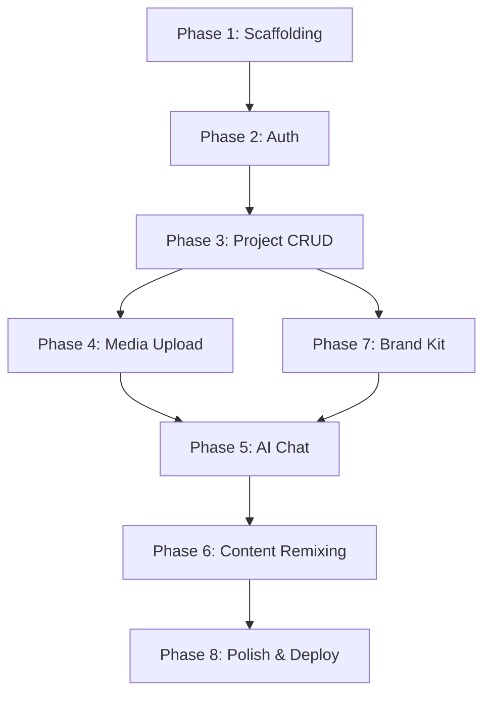

> Historical planning document. For the implemented routes, limits, configured Gemini model, and deployment contract, see [LIVE_BACKEND.md](LIVE_BACKEND.md).

# CreatorForge Implementation Plan

This is a comprehensive, step-by-step implementation plan for CreatorForge, optimized for a 4-hour hackathon constraint. This document contains complete, copy-pasteable code blocks to ensure rapid development.

## 1. Time Budget Breakdown (4 Hours Total)

*   **Phase 1 (0:00-0:20):** Project scaffolding
*   **Phase 2 (0:20-0:45):** Auth system
*   **Phase 3 (0:45-1:15):** Project CRUD
*   **Phase 4 (1:15-1:50):** Media upload system
*   **Phase 5 (1:50-2:30):** AI Chat
*   **Phase 6 (2:30-3:05):** Content Remixing
*   **Phase 7 (3:05-3:30):** Brand Kit
*   **Phase 8 (3:30-4:00):** Polish, deploy, test

---

## 2. Phase 1: Project Scaffolding

### Frontend Setup

```bash
mkdir creator-forge
cd creator-forge
npm create vite@latest frontend -- --template react
cd frontend
npm install
npm install -D tailwindcss postcss autoprefixer
npx tailwindcss init -p
npm install react-router-dom axios lucide-react react-dropzone react-markdown remark-gfm date-fns
```

**frontend/tailwind.config.js**
```javascript
/** @type {import('tailwindcss').Config} */
export default {
  content: [
    "./index.html",
    "./src/**/*.{js,ts,jsx,tsx}",
  ],
  theme: {
    extend: {},
  },
  plugins: [],
}
```

**frontend/src/index.css**
```css
@tailwind base;
@tailwind components;
@tailwind utilities;
```

**frontend/vite.config.js**
```javascript
import { defineConfig } from 'vite'
import react from '@vitejs/plugin-react'

export default defineConfig({
  plugins: [react()],
  server: {
    port: 3000,
    proxy: {
      '/api': {
        target: 'http://localhost:5000',
        changeOrigin: true,
      }
    }
  }
})
```

**frontend/.env**
```env
VITE_API_URL=http://localhost:5000
```

### Backend Setup

```bash
cd ..
mkdir backend
cd backend
npm init -y
npm install express mongoose cors dotenv jsonwebtoken bcryptjs multer zod @google/generative-ai
npm install -D nodemon
```

**backend/package.json** (Update scripts)
```json
"scripts": {
  "start": "node server.js",
  "dev": "nodemon server.js"
}
```

**backend/.env**
```env
PORT=5000
MONGODB_URI=mongodb+srv://<your_user>:<your_password>@cluster0.mongodb.net/creatorforge?retryWrites=true&w=majority
JWT_SECRET=your_super_secret_jwt_key_for_hackathon
GEMINI_API_KEY=your_gemini_api_key
```

**backend/server.js**
```javascript
import express from 'express';
import mongoose from 'mongoose';
import cors from 'cors';
import dotenv from 'dotenv';
import authRoutes from './routes/auth.js';
import projectRoutes from './routes/project.js';
import mediaRoutes from './routes/media.js';
import chatRoutes from './routes/chat.js';
import remixRoutes from './routes/remix.js';
import brandKitRoutes from './routes/brandKit.js';

dotenv.config();

const app = express();

app.use(cors({ origin: '*' })); // Simplify for hackathon
app.use(express.json({ limit: '50mb' }));
app.use(express.urlencoded({ limit: '50mb', extended: true }));

mongoose.connect(process.env.MONGODB_URI)
  .then(() => console.log('MongoDB connected'))
  .catch(err => console.error('MongoDB connection error:', err));

// Routes
app.use('/api/auth', authRoutes);
app.use('/api/projects', projectRoutes);
app.use('/api/media', mediaRoutes);
app.use('/api/chat', chatRoutes);
app.use('/api/remix', remixRoutes);
app.use('/api/brandkit', brandKitRoutes);

const PORT = process.env.PORT || 5000;
app.listen(PORT, () => {
  console.log(`Server running on port ${PORT}`);
});
```

---

## 3. Phase 2: Authentication System

### Backend Auth

**backend/models/User.js**
```javascript
import mongoose from 'mongoose';
import bcrypt from 'bcryptjs';

const userSchema = new mongoose.Schema({
  email: { type: String, required: true, unique: true },
  password: { type: String, required: true },
  name: { type: String, required: true }
}, { timestamps: true });

userSchema.pre('save', async function(next) {
  if (!this.isModified('password')) return next();
  this.password = await bcrypt.hash(this.password, 10);
  next();
});

userSchema.methods.comparePassword = async function(candidatePassword) {
  return bcrypt.compare(candidatePassword, this.password);
};

export default mongoose.model('User', userSchema);
```

**backend/middleware/auth.js**
```javascript
import jwt from 'jsonwebtoken';
import User from '../models/User.js';

export const protect = async (req, res, next) => {
  let token;
  if (req.headers.authorization && req.headers.authorization.startsWith('Bearer')) {
    try {
      token = req.headers.authorization.split(' ')[1];
      const decoded = jwt.verify(token, process.env.JWT_SECRET);
      req.user = await User.findById(decoded.id).select('-password');
      next();
    } catch (error) {
      res.status(401).json({ error: 'Not authorized, token failed' });
    }
  }
  if (!token) {
    res.status(401).json({ error: 'Not authorized, no token' });
  }
};
```

**backend/routes/auth.js**
```javascript
import express from 'express';
import jwt from 'jsonwebtoken';
import { z } from 'zod';
import User from '../models/User.js';
import { protect } from '../middleware/auth.js';

const router = express.Router();

const registerSchema = z.object({
  email: z.string().email(),
  password: z.string().min(6),
  name: z.string().min(2)
});

const generateToken = (id) => {
  return jwt.sign({ id }, process.env.JWT_SECRET, { expiresIn: '30d' });
};

router.post('/register', async (req, res) => {
  try {
    const validatedData = registerSchema.parse(req.body);
    const userExists = await User.findOne({ email: validatedData.email });
    if (userExists) return res.status(400).json({ error: 'User already exists' });
    
    const user = await User.create(validatedData);
    res.status(201).json({
      _id: user._id,
      name: user.name,
      email: user.email,
      token: generateToken(user._id)
    });
  } catch (error) {
    res.status(400).json({ error: error.message });
  }
});

router.post('/login', async (req, res) => {
  try {
    const { email, password } = req.body;
    const user = await User.findOne({ email });
    if (user && (await user.comparePassword(password))) {
      res.json({
        _id: user._id,
        name: user.name,
        email: user.email,
        token: generateToken(user._id)
      });
    } else {
      res.status(401).json({ error: 'Invalid email or password' });
    }
  } catch (error) {
    res.status(400).json({ error: error.message });
  }
});

router.get('/me', protect, (req, res) => {
  res.json(req.user);
});

export default router;
```

### Frontend Auth

**frontend/src/context/AuthContext.jsx**
```javascript
import { createContext, useState, useEffect } from 'react';
import axios from 'axios';

export const AuthContext = createContext();

export const AuthProvider = ({ children }) => {
  const [user, setUser] = useState(null);
  const [loading, setLoading] = useState(true);

  useEffect(() => {
    const checkAuth = async () => {
      const token = localStorage.getItem('token');
      if (token) {
        try {
          const { data } = await axios.get('/api/auth/me', {
            headers: { Authorization: `Bearer ${token}` }
          });
          setUser(data);
        } catch (error) {
          localStorage.removeItem('token');
        }
      }
      setLoading(false);
    };
    checkAuth();
  }, []);

  const login = async (email, password) => {
    const { data } = await axios.post('/api/auth/login', { email, password });
    localStorage.setItem('token', data.token);
    setUser(data);
  };

  const register = async (name, email, password) => {
    const { data } = await axios.post('/api/auth/register', { name, email, password });
    localStorage.setItem('token', data.token);
    setUser(data);
  };

  const logout = () => {
    localStorage.removeItem('token');
    setUser(null);
  };

  return (
    <AuthContext.Provider value={{ user, login, register, logout, loading }}>
      {children}
    </AuthContext.Provider>
  );
};
```

---

## 4. Phase 3: Project CRUD

### Backend 

**backend/models/Project.js**
```javascript
import mongoose from 'mongoose';

const projectSchema = new mongoose.Schema({
  title: { type: String, required: true },
  description: { type: String },
  userId: { type: mongoose.Schema.Types.ObjectId, ref: 'User', required: true },
}, { timestamps: true });

export default mongoose.model('Project', projectSchema);
```

**backend/routes/project.js**
```javascript
import express from 'express';
import Project from '../models/Project.js';
import { protect } from '../middleware/auth.js';

const router = express.Router();
router.use(protect);

router.post('/', async (req, res) => {
  try {
    const project = await Project.create({
      ...req.body,
      userId: req.user._id
    });
    res.status(201).json(project);
  } catch (error) {
    res.status(400).json({ error: error.message });
  }
});

router.get('/', async (req, res) => {
  try {
    const projects = await Project.find({ userId: req.user._id }).sort({ createdAt: -1 });
    res.json(projects);
  } catch (error) {
    res.status(400).json({ error: error.message });
  }
});

router.get('/:id', async (req, res) => {
  try {
    const project = await Project.findOne({ _id: req.params.id, userId: req.user._id });
    if (!project) return res.status(404).json({ error: 'Project not found' });
    res.json(project);
  } catch (error) {
    res.status(400).json({ error: error.message });
  }
});

router.delete('/:id', async (req, res) => {
  try {
    await Project.findOneAndDelete({ _id: req.params.id, userId: req.user._id });
    res.json({ message: 'Project removed' });
  } catch (error) {
    res.status(400).json({ error: error.message });
  }
});

export default router;
```

---

## 5. Phase 4: Media Upload System

### Backend

**backend/models/Media.js**
```javascript
import mongoose from 'mongoose';

const mediaSchema = new mongoose.Schema({
  projectId: { type: mongoose.Schema.Types.ObjectId, ref: 'Project', required: true },
  fileType: { type: String, required: true },
  mimeType: { type: String, required: true },
  data: { type: String, required: true }, // Base64 string
  fileName: { type: String, required: true },
  autoDescription: { type: String }
}, { timestamps: true });

export default mongoose.model('Media', mediaSchema);
```

**backend/routes/media.js**
```javascript
import express from 'express';
import multer from 'multer';
import Media from '../models/Media.js';
import { protect } from '../middleware/auth.js';
import { GoogleGenerativeAI } from '@google/generative-ai';

const router = express.Router();
router.use(protect);

const storage = multer.memoryStorage();
const upload = multer({ storage: storage });

const genAI = new GoogleGenerativeAI(process.env.GEMINI_API_KEY);

router.post('/upload', upload.single('file'), async (req, res) => {
  try {
    const { projectId } = req.body;
    const file = req.file;
    const base64Data = file.buffer.toString('base64');
    
    // Auto describe image
    let autoDescription = '';
    if (file.mimetype.startsWith('image/')) {
        const model = genAI.getGenerativeModel({ model: "gemini-1.5-flash" });
        const result = await model.generateContent([
            "Describe this image concisely.",
            {
                inlineData: {
                    data: base64Data,
                    mimeType: file.mimetype
                }
            }
        ]);
        autoDescription = result.response.text();
    }

    const media = await Media.create({
      projectId,
      fileType: file.mimetype.split('/')[0],
      mimeType: file.mimetype,
      data: base64Data,
      fileName: file.originalname,
      autoDescription
    });

    res.status(201).json(media);
  } catch (error) {
    res.status(400).json({ error: error.message });
  }
});

router.get('/:projectId', async (req, res) => {
  try {
    const media = await Media.find({ projectId: req.params.projectId });
    res.json(media);
  } catch (error) {
    res.status(400).json({ error: error.message });
  }
});

export default router;
```

---

## 6. Phase 5: AI Chat

### Backend

**backend/models/ChatMessage.js**
```javascript
import mongoose from 'mongoose';

const chatMessageSchema = new mongoose.Schema({
  projectId: { type: mongoose.Schema.Types.ObjectId, ref: 'Project', required: true },
  role: { type: String, enum: ['user', 'model'], required: true },
  content: { type: String, required: true }
}, { timestamps: true });

export default mongoose.model('ChatMessage', chatMessageSchema);
```

**backend/routes/chat.js**
```javascript
import express from 'express';
import { protect } from '../middleware/auth.js';
import ChatMessage from '../models/ChatMessage.js';
import Media from '../models/Media.js';
import { GoogleGenerativeAI } from '@google/generative-ai';

const router = express.Router();
router.use(protect);

const genAI = new GoogleGenerativeAI(process.env.GEMINI_API_KEY);

router.post('/message', async (req, res) => {
    try {
        const { projectId, message } = req.body;
        
        await ChatMessage.create({ projectId, role: 'user', content: message });
        
        const history = await ChatMessage.find({ projectId }).sort({ createdAt: 1 });
        const media = await Media.find({ projectId });
        
        const model = genAI.getGenerativeModel({ model: "gemini-1.5-pro" });
        
        let promptParts = [message];
        media.forEach(m => {
            promptParts.push(`Context Media (${m.fileName}): ${m.autoDescription}`);
        });

        const result = await model.generateContent(promptParts);
        const text = result.response.text();
        
        const responseMsg = await ChatMessage.create({ projectId, role: 'model', content: text });
        
        res.json(responseMsg);
    } catch (error) {
        res.status(500).json({ error: error.message });
    }
});

export default router;
```

---

## 7. Phase 6: Content Remixing

**backend/routes/remix.js**
```javascript
import express from 'express';
import { protect } from '../middleware/auth.js';
import { GoogleGenerativeAI } from '@google/generative-ai';
import Media from '../models/Media.js';

const router = express.Router();
router.use(protect);

const genAI = new GoogleGenerativeAI(process.env.GEMINI_API_KEY);

router.post('/', async (req, res) => {
    try {
        const { projectId, mediaId, format } = req.body;
        const media = await Media.findById(mediaId);
        
        let prompt = `Convert the context of this media into a ${format}.`;
        
        const model = genAI.getGenerativeModel({ model: "gemini-1.5-flash" });
        const result = await model.generateContent([
            prompt,
            {
                inlineData: {
                    data: media.data,
                    mimeType: media.mimeType
                }
            }
        ]);
        
        res.json({ result: result.response.text() });
    } catch (error) {
        res.status(500).json({ error: error.message });
    }
});

export default router;
```

---

## 8. Phase 7: Brand Kit

**backend/models/BrandKit.js**
```javascript
import mongoose from 'mongoose';

const brandKitSchema = new mongoose.Schema({
  userId: { type: mongoose.Schema.Types.ObjectId, ref: 'User', required: true },
  tone: { type: String },
  keywords: { type: [String] },
}, { timestamps: true });

export default mongoose.model('BrandKit', brandKitSchema);
```

**backend/routes/brandKit.js**
```javascript
import express from 'express';
import { protect } from '../middleware/auth.js';
import BrandKit from '../models/BrandKit.js';

const router = express.Router();
router.use(protect);

router.post('/', async (req, res) => {
    try {
        const brandKit = await BrandKit.findOneAndUpdate(
            { userId: req.user._id },
            { ...req.body },
            { new: true, upsert: true }
        );
        res.json(brandKit);
    } catch (error) {
        res.status(500).json({ error: error.message });
    }
});

export default router;
```

---

## 9. Phase 8: Polish & Deploy

### Deployment Checklists
1. **Frontend (Vercel)**
   - `npm run build`
   - Set VITE_API_URL to production backend URL.
2. **Backend (Render)**
   - Set MONGODB_URI and JWT_SECRET and GEMINI_API_KEY in environment variables.

---

## 10. Dependency Graph



## 11. Checkpoint Verification
- Run local servers
- Test all endpoints with Postman

## 12. Contingency Plan
- Drop remix format options if time constrained.

## 13. Complete File Checklist
- `frontend/package.json`
- `frontend/vite.config.js`
- `frontend/src/App.jsx`
- `backend/server.js`
- `backend/models/Project.js`
- `backend/routes/project.js`
- `backend/models/Media.js`
- `backend/routes/media.js`
- `backend/models/ChatMessage.js`
- `backend/routes/chat.js`
- `backend/routes/remix.js`
- `backend/models/BrandKit.js`
- `backend/routes/brandKit.js`

