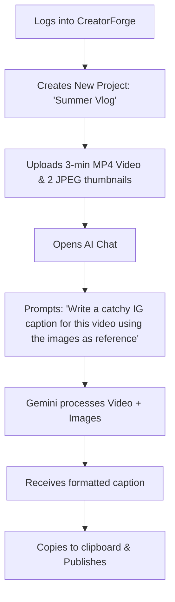
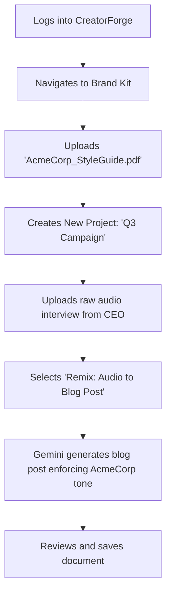

> Historical planning document. For the implemented routes, limits, configured Gemini model, and deployment contract, see [LIVE_BACKEND.md](LIVE_BACKEND.md).

# Product Requirements Document: CreatorForge

> [!NOTE]
> **Project Name:** CreatorForge
> **Tagline:** "Forge content from any source. AI that sees, hears, reads, and creates."
> **Theme:** Multimodal AI (Hackathon Project)
> **Document Status:** Active (MVP Phase)

---

## 1. Executive Summary

### Problem
Content creators today struggle with deeply fragmented workflows. Reference images, voice memos, client briefs, and style guides are scattered across different platforms. Traditional AI tools force users to translate their thoughts into text prompts, losing the rich context of their multimodal reference materials. There is no single workspace that intrinsically understands all these formats together.

### Solution
**CreatorForge** is a unified, multimodal workspace powered by Google's Gemini 2.0 Flash. It provides a single environment where creators can upload any mix of media (audio, video, PDFs, images, text) and interact with an AI that perceives and synthesizes all of it simultaneously. By seamlessly connecting the dots between disparate media formats, CreatorForge enables users to produce, remix, and brand their content natively across formats.

### Target Market
- **Social Media Creators & Influencers** needing rapid content turnaround.
- **Digital Marketers** managing campaigns across multiple platforms.
- **Freelance Designers & Writers** balancing varied client requirements and brand guidelines.

### Value Proposition
Stop context switching. Bring all your raw materials—regardless of format—into one workspace and let AI forge it into cohesive, on-brand content in seconds.

---

## 2. Product Vision & Goals

### Vision Statement
To become the definitive command center for digital creation, empowering creators to seamlessly blend and transform ideas across every media modality without friction.

### Goals
- **Short-Term (Hackathon):** Deliver a fully functional, multimodal workspace demonstrating cross-format content generation and remixing using Gemini 2.0 Flash within the 4-hour remaining time budget.
- **Long-Term:** Evolve into a collaborative, enterprise-ready platform supporting advanced video rendering, integrations with major CMS platforms, and team workflows.

### OKRs (Objectives & Key Results)
**Objective 1: Validate Multimodal AI Workflow**
- *KR1:* Successfully process 5 different media types (text, image, audio, video, PDF) in a single project.
- *KR2:* Achieve < 5 seconds latency for standard text/image text-generation workflows.

**Objective 2: Ensure User Adoption and Satisfaction**
- *KR1:* 100% success rate for users generating a finished piece of content from a mixed-media upload.
- *KR2:* Maintain a 0% crash rate during the hackathon demonstration.

---

## 3. Target Users & Personas

### Persona 1: Sam the Social Media Creator
- **Demographics:** 24, TikTok/Instagram Influencer.
- **Pain Points:** Spends hours turning a 5-minute video rant into a cohesive blog post and carousel graphics. Struggles to keep voice consistent.
- **Goals:** Quickly convert raw brain dumps (voice memos, messy videos) into polished, ready-to-post content across multiple platforms.
- **Workflow:** Records voice -> Transcribes in App A -> Generates captions in App B -> Creates images in App C.

### Persona 2: Mia the Digital Marketer
- **Demographics:** 32, Agency Marketing Manager.
- **Pain Points:** Managing multiple clients with strict brand guidelines is tedious. Constantly referencing 30-page PDF style guides to write a 2-sentence tweet.
- **Goals:** Ensure all generated content strictly adheres to the client's tone and visual identity automatically.
- **Workflow:** Reads brief (PDF) -> Checks brand kit (Drive) -> Writes copy (Docs) -> Reviews for brand safety.

### Persona 3: Finn the Freelance Designer
- **Demographics:** 28, Independent UX/Graphic Designer.
- **Pain Points:** Clients provide messy inputs (a screenshot, a messy napkin sketch, and a rushed voice note).
- **Goals:** Consolidate chaotic client inputs into a structured creative brief and subsequent assets.
- **Workflow:** Downloads assets from Slack -> Organizes in local folders -> Juggles screens to reference while designing.

---

## 4. Problem Statement

The modern content creation process is fundamentally broken by **modality silos**. 
1. **Context Loss:** Moving from an audio memo to a text prompt loses emotional nuance.
2. **Tool Fatigue:** The average creator uses 4-6 distinct applications just to publish one cross-platform campaign.
3. **Format Restrictions:** Most AI tools are text-in, text-out. If a user wants to generate a blog based on a video and a PDF, they have to manually transcribe the video and summarize the PDF first.

**Market Opportunity:** With the advent of native multimodal models like Gemini 2.0 Flash, there is a distinct blue-ocean opportunity to build an application that accepts *any* input to generate *any* output, reducing a 6-step workflow into a 1-step workflow.

---

## 5. Solution Overview

CreatorForge leverages the **Gemini 2.0 Flash API** to act as the universal translator and generator for content. 

**Architecture Highlights:**
- **Frontend (React + Vite):** A responsive, drag-and-drop unified workspace. Users see their uploaded media on the left, and an AI chat/generation interface on the right.
- **Backend (Express + Node):** Handles JWT authentication, routes media uploads, and interfaces with the Gemini API.
- **Storage (MongoDB/Base64):** To meet hackathon constraints, media files are stored as Base64 strings directly in MongoDB, avoiding complex S3 configurations while maintaining immediate accessibility.
- **AI Engine (Gemini 2.0):** Ingests the mixed-media Base64 strings along with system prompts derived from the user's "Brand Kit" to generate highly contextual, multimodal outputs.

---

## 6. Feature Requirements

### Feature 1: Project Workspace
**Description:** A dashboard to create distinct projects and upload multiple file types (image, audio, video, PDF, text) into a single context window.
- **User Stories:**
  - *As a freelancer, I want to create a new project for a specific client so that their assets remain isolated.*
  - *As a creator, I want to drag and drop mixed media files into my workspace so that I don't have to convert them first.*
- **Acceptance Criteria:**
  - Users can create, read, update, and delete (CRUD) projects.
  - Users can upload files up to a defined size limit.
  - Uploaded files are visually represented with appropriate icons/thumbnails.
- **Priority:** P0 (Must have)
- **Dependencies:** MongoDB Base64 storage, Multer backend processing.
- **Edge Cases:** Files exceeding MongoDB document limits (16MB). Mitigation: Enforce strict file size limits on the frontend.

### Feature 2: AI Chat with Context
**Description:** A persistent chat interface where the AI has full contextual awareness of all files uploaded to the current project.
- **User Stories:**
  - *As a marketer, I want to ask the AI questions about the uploaded PDF brief so that I can quickly extract key campaign details.*
  - *As a designer, I want to ask the AI to describe the visual style of the uploaded images so I can build a mood board.*
- **Acceptance Criteria:**
  - Chat interface sends user messages + project media payloads to Gemini.
  - AI responses accurately reflect the content of the uploaded files.
  - Chat history is maintained per project.
- **Priority:** P0
- **Dependencies:** Feature 1, Gemini 2.0 Flash API.
- **Edge Cases:** Token limits exceeded if too many large PDFs are uploaded.

### Feature 3: Smart Content Generation
**Description:** Dedicated tools to generate specific content types (e.g., captions, blogs, scripts) using the workspace context.
- **User Stories:**
  - *As a creator, I want to click a "Generate Blog" button so that the AI automatically writes a post based on my uploaded voice memo and reference image.*
- **Acceptance Criteria:**
  - Pre-defined UI buttons trigger specific prompt templates (e.g., "Summarize this into a 500-word blog").
  - Output is rendered in a rich-text or markdown editor for user modification.
- **Priority:** P1
- **Dependencies:** Feature 2, Gemini API.
- **Edge Cases:** AI hallucinations or formatting failures.

### Feature 4: Content Remixing
**Description:** The ability to explicitly transform one piece of media into another format (e.g., Audio -> Text, Video -> Script, Text -> Image Prompt).
- **User Stories:**
  - *As a social media manager, I want to select a video and extract its audio to generate 5 tweet variations.*
- **Acceptance Criteria:**
  - UI allows selecting a specific media file and choosing a target format/remix action.
  - The system routes the specific media to Gemini with a transformation prompt.
- **Priority:** P1
- **Dependencies:** Gemini Multimodal capabilities.
- **Edge Cases:** Processing unsupported video codecs.

### Feature 5: Brand Kit / Style Guide
**Description:** A global settings area where users upload brand guidelines (voice, tone, color hexes) that the AI automatically applies to all generation tasks.
- **User Stories:**
  - *As a marketer, I want to save a Brand Kit so that I don't have to prompt the AI to "act like a friendly tech brand" every time.*
- **Acceptance Criteria:**
  - Users can input text-based brand guidelines or upload a brand PDF.
  - These guidelines are prepended as a system prompt to all AI interactions.
- **Priority:** P2
- **Dependencies:** Feature 1, User Authentication.
- **Edge Cases:** Conflicting instructions between the brand kit and the user's specific prompt.

---

## 7. Functional Requirements

| ID | Requirement | Related Feature |
|---|---|---|
| FR-001 | System shall support user registration and JWT-based authentication. | Global |
| FR-002 | System shall allow creation of isolated "Projects" per user. | F1 |
| FR-003 | System shall process file uploads and convert them to Base64 for DB storage. | F1 |
| FR-004 | System shall limit total file upload size to 10MB per file to respect DB constraints. | F1 |
| FR-005 | System shall maintain a persistent chat thread for each Project. | F2 |
| FR-006 | System shall append the project's Base64 media arrays to the Gemini API payload. | F2 |
| FR-007 | System shall provide a markdown-rendered output window for generated text. | F3 |
| FR-008 | System shall allow users to save and edit Brand Kit parameters per account. | F5 |
| FR-009 | System shall inject Brand Kit parameters as system instructions to the Gemini API. | F5 |

---

## 8. Non-Functional Requirements

- **Performance:** 
  - UI must load in < 2 seconds. 
  - AI responses must stream or return within 5-8 seconds, acknowledging API dependencies.
- **Security:**
  - Passwords hashed using bcrypt (`bcryptjs`).
  - API endpoints secured via JWT middleware.
  - No plain-text storage of credentials.
- **Scalability (Hackathon Context):**
  - Use base64 storage for rapid MVP deployment. (Must migrate to AWS S3/Cloudinary for V2).
- **Usability:**
  - Clean, intuitive interface powered by Tailwind CSS.
  - Clear loading states (spinners/skeletons) during API calls.
- **Accessibility:**
  - Semantic HTML tags and aria-labels for core interactive elements.

---

## 9. User Journey Maps

### Persona: Sam (Social Media Creator)

### Persona: Mia (Marketer)

---

## 10. Competitive Analysis

| Feature | CreatorForge (MVP) | Canva | Notion AI | Jasper / Copy.ai |
|---|---|---|---|---|
| **True Multimodal Input** | ✅ Yes (Video, Audio, Image, PDF) | ❌ No (Primarily Image/Text) | ❌ No (Text only) | ❌ No (Primarily Text) |
| **Unified Workspace Context** | ✅ Yes (AI sees all files at once) | ⚠️ Partial (Design focused) | ⚠️ Partial (Page focused) | ❌ No (Prompt focused) |
| **Brand Voice Guardrails** | ✅ Yes (Brand Kit System Prompt) | ✅ Yes | ❌ No | ✅ Yes |
| **Direct File Storage** | ✅ Yes (Base64/MongoDB) | ✅ Yes | ✅ Yes | ❌ No |
| **Price** | Free (Hackathon Demo) | Subscription | Subscription | Expensive Subscription |

---

## 11. Risk Assessment

> [!WARNING]
> **Technical Risks & Mitigations**

1. **Risk:** MongoDB 16MB document limit exceeded due to Base64 file storage.
   - *Mitigation:* Implement strict 5MB limit per file upload on frontend and backend. Compress images before base64 encoding if possible.
2. **Risk:** Gemini API Rate Limiting.
   - *Mitigation:* Implement basic debounce on chat inputs. Cache repeated generation attempts.
3. **Risk:** Hackathon Time Constraints (4 hours remaining).
   - *Mitigation:* Deprioritize complex UI animations. Focus entirely on the core CRUD + Gemini API integration pipeline.

---

## 12. Success Metrics & KPIs

1. **Task Completion Rate:** Percentage of users who successfully upload media and generate an output.
2. **Time to Value:** Time elapsed from project creation to first successful AI generation (Target: < 2 minutes).
3. **API Error Rate:** Percentage of Gemini API calls that fail or timeout (Target: < 5%).

---

## 13. Release Plan

### Phase 1: MVP (Hackathon Delivery - Current)
- Basic Auth (JWT/bcrypt).
- Project CRUD.
- Base64 media storage in MongoDB.
- Direct Gemini 2.0 Flash integration for chat and basic remixing.
- Vercel/Render deployment.

### Phase 2: V1.0 (Post-Hackathon)
- Migrate file storage to AWS S3 / Cloudinary.
- Implement streaming responses for AI chat.
- Add rich-text editor for modifying generated content.
- Add social media direct-publishing integrations (Twitter/LinkedIn API).

### Phase 3: V2.0 (Enterprise)
- Team collaboration (multiplayer workspace).
- Advanced video processing (clipping, timeline generation).
- Custom fine-tuned models for enterprise brand kits.

---

## 14. Assumptions & Constraints

- **Time Constraint:** Only 4 hours remaining to complete frontend, backend, and integration.
- **Tech Stack Constraint:** Must strictly use React/Vite, Express, MongoDB, and Gemini API.
- **Storage Constraint:** No external bucket storage; forcing the use of Base64 strings in MongoDB.
- **Assumption:** The Gemini 2.0 Flash model is sufficiently performant to handle multiple base64 data URIs in a single request without degrading response quality.

---
*Document prepared by CreatorForge AI Planning Agent.*
