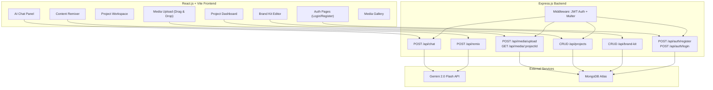

> Historical planning document. For the implemented routes, limits, configured Gemini model, and deployment contract, see [LIVE_BACKEND.md](LIVE_BACKEND.md).

# 🔥 CreatorForge — Refined Implementation Plan

## Goal
Build **CreatorForge**, a Multimodal AI Content Creator Toolkit for a hackathon in **~5 hours**. Creators upload mixed media (images, PDFs, audio, video, text), and AI understands all of it together — enabling cross-modal chat, smart content generation, content remixing, and brand-consistent output.

**Theme**: Multimodal AI  
**Problem**: Content creators juggle fragmented tools and formats. Reference images live in one place, voice memos in another, briefs in a third. No single tool understands all their content together.  
**Solution**: CreatorForge — one workspace where AI sees everything, connects the dots, and helps creators produce content across formats.  
**Tagline**: *"Forge content from any source. AI that sees, hears, reads, and creates."*

---

## User Review Required

> [!IMPORTANT]
> **Credentials needed before coding begins.** You'll need to provide:
> 1. `GEMINI_API_KEY` — from [aistudio.google.com](https://aistudio.google.com)
> 2. `MONGODB_URI` — your MongoDB Atlas connection string
> 3. `JWT_SECRET` — any random secret string (we can generate one)
>
> These go into `server/.env`.

> [!WARNING]
> **Mandatory tech stack enforced by hackathon rules:**
> - Frontend: React.js + Vite + Tailwind CSS
> - Backend: Express.js + JWT + bcrypt + Multer
> - Database: MongoDB
> - AI: Google Gemini API
> - Deployment: Frontend → Vercel, Backend → Render

---

## Open Questions
None — all decisions resolved! ✅

---

## Architecture Overview



---

## Tech Stack (Hackathon Compliant)

| Layer | Technology | Requirement |
|-------|-----------|-------------|
| Frontend | React.js + Vite | ✅ Required |
| Routing | React Router v6 | ✅ Required |
| Styling | Tailwind CSS | ✅ Allowed |
| HTTP Client | Axios | ✅ Required |
| Backend | Express.js | ✅ Required |
| Auth | JWT + bcrypt | ✅ Required |
| Validation | Zod | ✅ Allowed |
| File Upload | Multer | ✅ Required |
| Database | MongoDB (Mongoose ODM) | ✅ Allowed |
| AI | Google Gemini 2.0 Flash | ✅ Allowed |
| Frontend Deploy | Vercel | ✅ Required |
| Backend Deploy | Render | ✅ Required |

---

## Time Budget (5 Hours)

| Phase | Time | What | Priority |
|-------|------|------|----------|
| **1. Setup** | 0:00–0:25 | Scaffold React+Vite & Express, install deps, env config, MongoDB connection | 🔴 Critical |
| **2. Auth** | 0:25–0:55 | Register/Login pages, JWT middleware, bcrypt hashing | 🔴 Critical |
| **3. Project Workspace** | 0:55–1:30 | Project CRUD, dashboard UI, workspace layout | 🔴 Critical |
| **4. Media Upload** | 1:30–2:10 | Multer config, drag-drop upload UI, media gallery, base64 storage | 🔴 Critical |
| **5. AI Chat** | 2:10–3:00 | Chat UI, Gemini integration with multimodal context (all project media) | 🔴 Critical |
| **6. Content Remixing** | 3:00–3:45 | Remix UI, transformation endpoints (image→caption, audio→blog, etc.) | 🟡 High |
| **7. Brand Kit** | 3:45–4:20 | Brand kit editor, AI uses brand context in all generation | 🟡 High |
| **8. Polish & Deploy** | 4:20–5:00 | UI polish, error handling, deploy frontend→Vercel, backend→Render | 🔴 Critical |

---

## Database Schema (MongoDB / Mongoose)

### User Model
```javascript
const userSchema = new mongoose.Schema({
  name: { type: String, required: true },
  email: { type: String, required: true, unique: true },
  password: { type: String, required: true }, // bcrypt hashed
  createdAt: { type: Date, default: Date.now }
});
```

### Project Model
```javascript
const projectSchema = new mongoose.Schema({
  userId: { type: mongoose.Schema.Types.ObjectId, ref: 'User', required: true },
  name: { type: String, required: true },
  description: { type: String, default: '' },
  brandKit: {
    brandName: { type: String, default: '' },
    toneOfVoice: { type: String, default: 'professional' }, // casual, professional, playful, bold
    targetAudience: { type: String, default: '' },
    colorPalette: [String],          // hex codes
    keywords: [String],              // brand keywords
    styleGuideText: { type: String, default: '' } // free-form brand guidelines
  },
  createdAt: { type: Date, default: Date.now },
  updatedAt: { type: Date, default: Date.now }
});
```

### Media Model
```javascript
const mediaSchema = new mongoose.Schema({
  projectId: { type: mongoose.Schema.Types.ObjectId, ref: 'Project', required: true },
  userId: { type: mongoose.Schema.Types.ObjectId, ref: 'User', required: true },
  filename: { type: String, required: true },
  mimeType: { type: String, required: true },
  data: { type: String, required: true },           // base64 encoded
  fileSize: { type: Number, required: true },
  description: { type: String, default: '' },        // AI-generated description
  createdAt: { type: Date, default: Date.now }
});
```

### ChatMessage Model
```javascript
const chatMessageSchema = new mongoose.Schema({
  projectId: { type: mongoose.Schema.Types.ObjectId, ref: 'Project', required: true },
  userId: { type: mongoose.Schema.Types.ObjectId, ref: 'User', required: true },
  role: { type: String, enum: ['user', 'assistant'], required: true },
  content: { type: String, required: true },
  mediaIds: [{ type: mongoose.Schema.Types.ObjectId, ref: 'Media' }], // attached media
  inputType: { type: String, enum: ['text', 'voice', 'image', 'file', 'remix'], default: 'text' },
  createdAt: { type: Date, default: Date.now }
});
```

---

## Proposed Changes

### Component 1: Project Scaffolding

#### [NEW] `client/` — React + Vite frontend
```bash
npm create vite@latest client -- --template react
cd client
npm install react-router-dom axios lucide-react react-dropzone react-markdown
npm install -D tailwindcss @tailwindcss/vite
```

#### [NEW] `server/` — Express.js backend
```bash
mkdir server && cd server
npm init -y
npm install express mongoose bcryptjs jsonwebtoken multer cors dotenv zod @google/generative-ai
npm install -D nodemon
```

#### [NEW] `server/.env`
```env
PORT=5000
MONGODB_URI=mongodb+srv://...
JWT_SECRET=your-secret-key
GEMINI_API_KEY=your-gemini-key
CLIENT_URL=http://localhost:5173
```

---

### Component 2: Express.js Backend

#### [NEW] `server/index.js`
Entry point: Express app, CORS, JSON parsing, route mounting, MongoDB connection.

```javascript
const express = require('express');
const mongoose = require('mongoose');
const cors = require('cors');
require('dotenv').config();

const app = express();
app.use(cors({ origin: process.env.CLIENT_URL }));
app.use(express.json({ limit: '50mb' }));

// Routes
app.use('/api/auth', require('./routes/auth'));
app.use('/api/projects', require('./routes/projects'));
app.use('/api/media', require('./routes/media'));
app.use('/api/chat', require('./routes/chat'));
app.use('/api/remix', require('./routes/remix'));
app.use('/api/brand-kit', require('./routes/brandKit'));

mongoose.connect(process.env.MONGODB_URI)
  .then(() => {
    app.listen(process.env.PORT, () => 
      console.log(`Server running on port ${process.env.PORT}`)
    );
  });
```

#### [NEW] `server/middleware/auth.js`
JWT verification middleware:
```javascript
const jwt = require('jsonwebtoken');

module.exports = (req, res, next) => {
  const token = req.header('Authorization')?.replace('Bearer ', '');
  if (!token) return res.status(401).json({ error: 'Access denied' });
  try {
    req.user = jwt.verify(token, process.env.JWT_SECRET);
    next();
  } catch (err) {
    res.status(401).json({ error: 'Invalid token' });
  }
};
```

#### [NEW] `server/middleware/upload.js`
Multer config for multimodal file uploads:
```javascript
const multer = require('multer');

const storage = multer.memoryStorage();
const upload = multer({
  storage,
  limits: { fileSize: 20 * 1024 * 1024 }, // 20MB
  fileFilter: (req, file, cb) => {
    const allowed = [
      'image/jpeg', 'image/png', 'image/gif', 'image/webp',
      'application/pdf',
      'audio/mpeg', 'audio/wav', 'audio/webm',
      'video/mp4', 'video/webm',
      'text/plain'
    ];
    cb(null, allowed.includes(file.mimetype));
  }
});

module.exports = upload;
```

---

### Component 3: Auth Routes

#### [NEW] `server/routes/auth.js`

| Endpoint | Method | Body | Response |
|----------|--------|------|----------|
| `/api/auth/register` | POST | `{ name, email, password }` | `{ token, user }` |
| `/api/auth/login` | POST | `{ email, password }` | `{ token, user }` |
| `/api/auth/me` | GET | — (JWT header) | `{ user }` |

Password hashed with `bcrypt.hash(password, 10)`, token generated with `jwt.sign({ id, email }, JWT_SECRET, { expiresIn: '7d' })`.

---

### Component 4: Project Routes

#### [NEW] `server/routes/projects.js`

| Endpoint | Method | Description |
|----------|--------|-------------|
| `GET /api/projects` | GET | List user's projects |
| `POST /api/projects` | POST | Create new project |
| `GET /api/projects/:id` | GET | Get project with media count |
| `PUT /api/projects/:id` | PUT | Update project name/description |
| `DELETE /api/projects/:id` | DELETE | Delete project + all media + messages |

---

### Component 5: Media Upload Routes

#### [NEW] `server/routes/media.js`

| Endpoint | Method | Description |
|----------|--------|-------------|
| `POST /api/media/upload/:projectId` | POST | Upload file(s) via Multer, store base64 in MongoDB, auto-generate AI description |
| `GET /api/media/:projectId` | GET | List all media in a project |
| `DELETE /api/media/:id` | DELETE | Delete a media item |

On upload, Gemini auto-generates a description of each file:
```javascript
// After storing media, generate AI description
const model = genAI.getGenerativeModel({ model: 'gemini-2.0-flash' });
const result = await model.generateContent([
  { inlineData: { mimeType: file.mimetype, data: base64Data } },
  'Describe this content in 1-2 sentences for a content creator.'
]);
media.description = result.response.text();
await media.save();
```

---

### Component 6: AI Chat Routes

#### [NEW] `server/routes/chat.js`

| Endpoint | Method | Description |
|----------|--------|-------------|
| `POST /api/chat/:projectId` | POST | Send message with optional media, get AI response with full project context |
| `GET /api/chat/:projectId` | GET | Get chat history for project |

**Key feature**: The AI chat includes ALL project media as context, plus the brand kit. This is what makes it truly multimodal — the AI "sees" everything in the project.

```javascript
async function buildChatContext(projectId) {
  const project = await Project.findById(projectId);
  const media = await Media.find({ projectId }).sort({ createdAt: -1 }).limit(10);
  const history = await ChatMessage.find({ projectId }).sort({ createdAt: -1 }).limit(20);

  // Build multimodal content array for Gemini
  const contextParts = [];

  // Add brand kit context
  if (project.brandKit?.brandName) {
    contextParts.push({
      text: `BRAND CONTEXT: Brand "${project.brandKit.brandName}". 
Tone: ${project.brandKit.toneOfVoice}. 
Audience: ${project.brandKit.targetAudience}.
Keywords: ${project.brandKit.keywords?.join(', ')}.
Style Guide: ${project.brandKit.styleGuideText}`
    });
  }

  // Add media context (most recent files)
  for (const m of media.slice(0, 5)) {
    contextParts.push({
      inlineData: { mimeType: m.mimeType, data: m.data }
    });
    contextParts.push({
      text: `[File: ${m.filename} — ${m.description}]`
    });
  }

  return { contextParts, history, project };
}
```

---

### Component 7: Content Remixing Routes

#### [NEW] `server/routes/remix.js`

| Endpoint | Method | Description |
|----------|--------|-------------|
| `POST /api/remix` | POST | Transform content from one format to another |

**Supported transformations:**

| From | To | Prompt Strategy |
|------|----|----------------|
| Image | Caption/Description | "Write an engaging social media caption for this image..." |
| Image | Blog Post | "Write a blog post inspired by this image..." |
| Audio | Blog Post | "Transcribe and expand this audio into a blog post..." |
| Audio | Social Thread | "Convert this audio into a Twitter/X thread..." |
| Video | Summary | "Summarize the key points of this video..." |
| Video | Script | "Write a script based on this video content..." |
| PDF/Doc | Social Posts | "Create 5 social media posts from this document..." |
| Text | Image Prompt | "Generate a detailed image generation prompt from this brief..." |
| Any | Custom | User provides their own transformation instruction |

```javascript
router.post('/', auth, async (req, res) => {
  const { mediaId, transformType, customPrompt, projectId } = req.body;
  const media = await Media.findById(mediaId);
  const project = await Project.findById(projectId);

  const brandContext = project.brandKit?.brandName
    ? `Match this brand voice: ${project.brandKit.toneOfVoice}. Brand: ${project.brandKit.brandName}. Audience: ${project.brandKit.targetAudience}.`
    : '';

  const prompts = {
    'image-to-caption': `Write 3 engaging social media captions for this image. ${brandContext}`,
    'image-to-blog': `Write a 300-word blog post inspired by this image. ${brandContext}`,
    'audio-to-blog': `Transcribe this audio and expand it into a polished blog post. ${brandContext}`,
    'audio-to-thread': `Convert this audio into a 5-tweet Twitter/X thread. ${brandContext}`,
    'video-to-summary': `Summarize the key points of this video in bullet points. ${brandContext}`,
    'video-to-script': `Write a video script based on this content. ${brandContext}`,
    'doc-to-social': `Create 5 social media posts from this document. ${brandContext}`,
    'text-to-imageprompt': `Generate a detailed image generation prompt based on this brief. ${brandContext}`,
    'custom': customPrompt + ' ' + brandContext
  };

  const model = genAI.getGenerativeModel({ model: 'gemini-2.0-flash' });
  const result = await model.generateContent([
    { inlineData: { mimeType: media.mimeType, data: media.data } },
    prompts[transformType] || prompts['custom']
  ]);

  res.json({ result: result.response.text() });
});
```

---

### Component 8: Brand Kit Routes

#### [NEW] `server/routes/brandKit.js`

| Endpoint | Method | Description |
|----------|--------|-------------|
| `PUT /api/brand-kit/:projectId` | PUT | Update brand kit for a project |
| `GET /api/brand-kit/:projectId` | GET | Get brand kit |

---

### Component 9: React Frontend

#### [NEW] `client/src/App.jsx`
React Router setup:
```jsx
<Routes>
  <Route path="/login" element={<Login />} />
  <Route path="/register" element={<Register />} />
  <Route path="/" element={<ProtectedRoute><Dashboard /></ProtectedRoute>} />
  <Route path="/project/:id" element={<ProtectedRoute><Workspace /></ProtectedRoute>} />
</Routes>
```

#### [NEW] `client/src/pages/Login.jsx` & `Register.jsx`
Clean auth forms with email/password. Stores JWT in localStorage.

#### [NEW] `client/src/pages/Dashboard.jsx`
- Grid of project cards with name, description, media count, last updated
- "New Project" button with modal
- Click project → navigate to workspace

#### [NEW] `client/src/pages/Workspace.jsx`
**Main page — the star of the demo.** Split layout:

```
┌─────────────────────────────────────────────────────┐
│  Header: Project Name | Brand Kit | Settings        │
├──────────────┬──────────────────────────────────────┤
│              │                                      │
│  Media       │   Tab: Chat | Remix | Generated      │
│  Gallery     │                                      │
│              │   [Active tab content]                │
│  + Upload    │                                      │
│              │                                      │
│  Drag & Drop │                                      │
│              │                                      │
├──────────────┴──────────────────────────────────────┤
│  Upload Zone (drag files here)                       │
└─────────────────────────────────────────────────────┘
```

#### [NEW] `client/src/components/MediaGallery.jsx`
- Grid of uploaded media with thumbnails
- Shows file type icon (🖼️ image, 🎵 audio, 🎬 video, 📄 doc)
- AI-generated description below each item
- Click to select for remix/chat reference
- Delete button

#### [NEW] `client/src/components/ChatPanel.jsx`
- Message list with markdown rendering
- Text input + file attach button
- Shows which media the AI is referencing
- Loading state with typing indicator

#### [NEW] `client/src/components/RemixPanel.jsx`
- Select source media from gallery
- Choose transformation type from dropdown
- Optional custom prompt
- "Forge It!" button
- Result displayed with copy button
- Save result to project

#### [NEW] `client/src/components/BrandKitEditor.jsx`
- Form fields: brand name, tone of voice (dropdown), target audience, keywords (tags), style guide (textarea)
- Color palette picker
- Save button → updates project's brandKit
- Visual preview of brand settings

#### [NEW] `client/src/components/FileUploader.jsx`
- Drag-and-drop zone using `react-dropzone`
- Progress indicator
- Accepts: images, PDFs, audio, video, text files
- Multi-file upload support

#### [NEW] `client/src/context/AuthContext.jsx`
React context for auth state (user, token, login, logout, register functions).

#### [NEW] `client/src/lib/api.js`
Axios instance with base URL and JWT interceptor:
```javascript
import axios from 'axios';

const api = axios.create({
  baseURL: import.meta.env.VITE_API_URL || 'http://localhost:5000/api'
});

api.interceptors.request.use((config) => {
  const token = localStorage.getItem('token');
  if (token) config.headers.Authorization = `Bearer ${token}`;
  return config;
});

export default api;
```

---

## File Structure

```
creatorforge/
├── client/                          # React + Vite Frontend
│   ├── src/
│   │   ├── App.jsx                  # Router + layout
│   │   ├── main.jsx                 # Entry point
│   │   ├── index.css                # Tailwind imports + custom styles
│   │   ├── pages/
│   │   │   ├── Login.jsx
│   │   │   ├── Register.jsx
│   │   │   ├── Dashboard.jsx
│   │   │   └── Workspace.jsx
│   │   ├── components/
│   │   │   ├── Navbar.jsx
│   │   │   ├── ProtectedRoute.jsx
│   │   │   ├── MediaGallery.jsx
│   │   │   ├── ChatPanel.jsx
│   │   │   ├── RemixPanel.jsx
│   │   │   ├── BrandKitEditor.jsx
│   │   │   ├── FileUploader.jsx
│   │   │   └── ProjectCard.jsx
│   │   ├── context/
│   │   │   └── AuthContext.jsx
│   │   └── lib/
│   │       └── api.js
│   ├── .env
│   ├── index.html
│   ├── vite.config.js
│   ├── tailwind.config.js
│   └── package.json
│
├── server/                          # Express.js Backend
│   ├── index.js                     # App entry
│   ├── models/
│   │   ├── User.js
│   │   ├── Project.js
│   │   ├── Media.js
│   │   └── ChatMessage.js
│   ├── routes/
│   │   ├── auth.js
│   │   ├── projects.js
│   │   ├── media.js
│   │   ├── chat.js
│   │   ├── remix.js
│   │   └── brandKit.js
│   ├── middleware/
│   │   ├── auth.js
│   │   └── upload.js
│   ├── lib/
│   │   └── gemini.js
│   ├── .env
│   └── package.json
│
├── .gitignore
└── README.md
```

---

## Deployment Plan

### Frontend → Vercel
```bash
cd client
npm run build
# Connect GitHub repo to Vercel
# Set env: VITE_API_URL=https://creatorforge-api.onrender.com/api
```

### Backend → Render
```bash
# Connect GitHub repo to Render
# Set env: MONGODB_URI, JWT_SECRET, GEMINI_API_KEY, CLIENT_URL
# Build command: npm install
# Start command: node index.js
```

---

## Verification Plan

### Manual Verification Checklist

| # | Feature | Test |
|---|---------|------|
| 1 | Register | Create account → verify success |
| 2 | Login | Login → verify JWT stored, redirected to dashboard |
| 3 | Create Project | Create new project → appears on dashboard |
| 4 | Upload Image | Drag image → appears in gallery with AI description |
| 5 | Upload PDF | Upload PDF → AI generates description |
| 6 | Upload Audio | Upload audio clip → AI describes content |
| 7 | Upload Video | Upload short video → AI describes it |
| 8 | AI Chat (text) | Ask "what content can I make from these files?" → relevant response |
| 9 | AI Chat (multimodal) | Attach image in chat → AI references it |
| 10 | Remix: Image→Caption | Select image → remix to caption → get 3 captions |
| 11 | Remix: Audio→Blog | Select audio → remix to blog → get blog post |
| 12 | Remix: Doc→Social | Select PDF → remix to social posts → get 5 posts |
| 13 | Brand Kit | Set brand name + tone → remix again → output matches brand voice |
| 14 | Persistence | Refresh page → all data still there |
| 15 | Deploy | Frontend on Vercel + Backend on Render → works end-to-end |

### Demo Flow (3-5 minute video)

1. **Open CreatorForge** → show clean dashboard
2. **Create a project** → "Summer Campaign"
3. **Upload mixed media** → drag in a product photo, a voice memo describing the campaign, and a brand guidelines PDF
4. **Show AI auto-descriptions** → each file gets an intelligent description
5. **Open AI Chat** → ask "Based on all my uploaded content, suggest 3 content ideas for Instagram"
6. **Content Remixing** → select the product photo → remix to "Instagram Caption" → show 3 brand-consistent captions
7. **Remix audio** → select voice memo → remix to "Blog Post" → show polished article
8. **Brand Kit** → set tone to "playful", add brand keywords → remix again → show output matches new tone
9. **Pitch**: *"CreatorForge understands your images, audio, video, and documents together — then forges new content that stays on-brand. One workspace. Every format. Your AI creative partner."*

---

## Key Risks & Mitigations

| Risk | Impact | Mitigation |
|------|--------|-----------|
| Base64 storage bloats MongoDB | Large files slow down queries | Limit file size to 10MB, only store latest 20 files per project |
| Gemini API rate limits | Chat/remix fails mid-demo | Use Gemini 2.0 Flash (higher limits), add retry with backoff |
| Video files too large for Gemini | Video remix fails | Limit video to 20MB, show error for larger |
| CORS issues between Vite dev + Express | Frontend can't reach API | CORS configured from the start with `CLIENT_URL` env var |
| Render cold starts | Backend slow in demo | Keep backend warm with a ping route, hit it before demo |
| 5 hours runs short | Not all features done | Phases ordered by priority — first 5 phases = strong demo alone |
