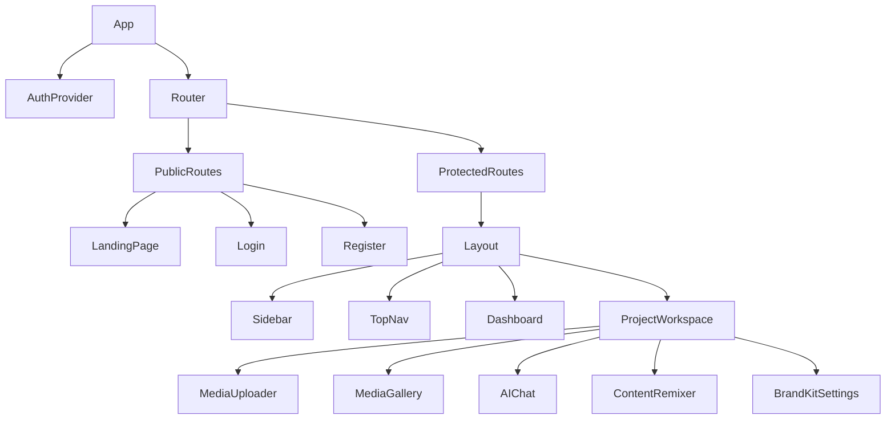
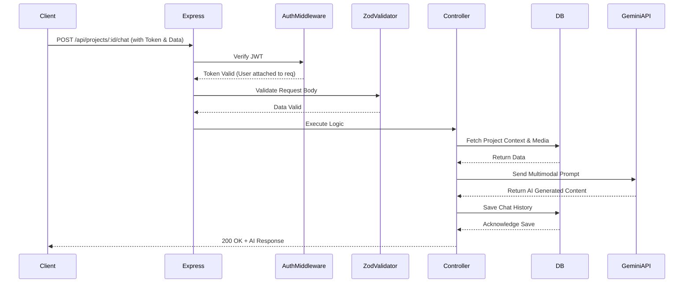

# CreatorForge - Technical Requirements Document (TRD)

## 1. Technical Overview
CreatorForge is a cutting-edge multimodal AI workspace designed for content creators. The system allows users to upload diverse media formats (images, audio, video, PDFs, and text documents) into a unified project workspace. It leverages the advanced capabilities of the Google Gemini 2.0 Flash API to understand and connect the dots across all these formats, enabling smart content generation, remixing, and brand-consistent outputs.

### System Architecture
The application follows a standard modern MERN stack architecture (MongoDB, Express, React, Node.js), adapted for a hackathon environment.
*   **Client Layer:** A Single Page Application (SPA) built with React and Vite, handling the UI, state, and client-side routing.
*   **API Layer:** A RESTful Node.js/Express backend that orchestrates data flow, authentication, file processing, and communication with the AI service.
*   **Data Layer:** MongoDB (hosted on Atlas) stores user accounts, project metadata, chat history, and handles file storage (using Base64 encoding to meet the constraint of no external storage services).
*   **AI Service:** Google Gemini 2.0 Flash API acts as the cognitive engine for processing multimodal inputs and generating content.

---

## 2. Architecture Diagram

```mermaid
flowchart TD
    subgraph Client [Client-Side (React/Vite)]
        UI[User Interface / React Components]
        State[State Management / Context]
        Router[React Router]
        Axios[API Client / Axios]
        
        UI --> State
        UI --> Router
        State --> Axios
    end

    subgraph Server [Backend Server (Express/Node.js)]
        API[Express Router]
        Auth[JWT Middleware]
        Upload[Multer Middleware]
        Logic[Business Logic / Controllers]
        Zod[Validation / Zod]
        
        Axios -->|HTTP/REST| API
        API --> Auth
        API --> Upload
        API --> Zod
        Auth --> Logic
        Upload --> Logic
        Zod --> Logic
    end

    subgraph Data [Database (MongoDB Atlas)]
        Users[(Users Collection)]
        Projects[(Projects Collection)]
        Media[(Media/Files Base64)]
        Chats[(Chat History)]
        
        Logic -->|Mongoose ODM| Users
        Logic -->|Mongoose ODM| Projects
        Logic -->|Mongoose ODM| Media
        Logic -->|Mongoose ODM| Chats
    end

    subgraph AI [External Services]
        Gemini[Google Gemini 2.0 Flash API]
    end
    
    Logic <-->|Multimodal Prompts| Gemini
```

---

## 3. Technology Stack Deep Dive

### Frontend
*   **React.js (v18.x):** Chosen for its component-based architecture and vast ecosystem.
*   **Vite (v5.x):** Used as the build tool for extremely fast HMR (Hot Module Replacement) and optimized production builds. Far superior to Create React App for hackathon speed.
*   **React Router (v6.x):** Standard declarative routing for React applications.
*   **Tailwind CSS (v3.x):** Utility-first CSS framework for rapid UI development without writing custom CSS.
*   **Axios (v1.x):** Promise-based HTTP client for easy request configuration and interceptors (useful for injecting JWTs).

### Backend
*   **Node.js (v20.x LTS) & Express.js (v4.x):** Lightweight, fast, and unopinionated server framework. Perfect for quickly spinning up REST APIs.
*   **JWT (jsonwebtoken v9.x):** Stateless authentication mechanism. Chosen because it avoids session store complexities.
*   **Bcrypt.js (v2.x):** For securely hashing user passwords before database insertion.
*   **Multer (v1.4.x):** Middleware for handling `multipart/form-data`, primarily used for file uploads. Configured for memory storage to easily convert to Base64.
*   **Zod (v3.x):** TypeScript-first schema declaration and validation library. Used for robust runtime validation of incoming request bodies.

### Database
*   **MongoDB (v7.x via Atlas) & Mongoose (v8.x):** NoSQL document database. Ideal for flexible schemas (like projects with varied media types). Mongoose provides schema validation and relationship mapping.

### AI Engine
*   **Google Gemini 2.0 Flash API (`@google/generative-ai` SDK):** Chosen for its exceptional speed and native multimodal capabilities (can process audio, video, images, and text in the same prompt).

---

## 4. Frontend Architecture

### React Component Tree


### State Management
Using React Context API for global state:
*   `AuthContext`: Manages user authentication state, JWT token, and user profile data.
*   `ProjectContext`: Manages currently active project, its media files, and chat history.

### Routing Structure (React Router v6)
```javascript
<Routes>
  <Route path="/" element={<LandingPage />} />
  <Route path="/login" element={<Login />} />
  <Route path="/register" element={<Register />} />
  <Route element={<ProtectedRoute />}>
    <Route element={<Layout />}>
      <Route path="/dashboard" element={<Dashboard />} />
      <Route path="/project/:projectId" element={<ProjectWorkspace />} />
      <Route path="/brand-kit" element={<BrandKitSettings />} />
    </Route>
  </Route>
</Routes>
```

### Tailwind CSS Configuration
Custom colors and fonts tailored to a creative tool:
```javascript
// tailwind.config.js
module.exports = {
  content: ["./index.html", "./src/**/*.{js,ts,jsx,tsx}"],
  theme: {
    extend: {
      colors: {
        brand: {
          dark: '#1a1a2e',
          primary: '#4f46e5',
          secondary: '#ec4899',
          accent: '#0ea5e9'
        }
      },
      fontFamily: {
        sans: ['Inter', 'sans-serif'],
      }
    },
  },
  plugins: [require('@tailwindcss/forms')],
}
```

---

## 5. Backend Architecture

### Express.js App Structure
```text
server/
├── config/         # DB connection, env variables
├── controllers/    # Route handler logic
├── middlewares/    # Auth, Multer, Error handlers
├── models/         # Mongoose schemas
├── routes/         # Express routers
├── services/       # Gemini AI API interactions, business logic
├── utils/          # Helpers (Base64 converters)
├── validations/    # Zod schemas
└── server.js       # Entry point
```

### Request/Response Lifecycle


### Error Handling Strategy
Centralized error handling middleware. Custom error classes for different HTTP statuses (e.g., `NotFoundError`, `UnauthorizedError`). All controllers wrapped in a `try/catch` or an async wrapper that forwards errors to `next(err)`.

---

## 6. Database Architecture (MongoDB)

### Schema Design & Mongoose Models

**User Model (`models/User.js`)**
```javascript
const userSchema = new mongoose.Schema({
  email: { type: String, required: true, unique: true, index: true },
  password: { type: String, required: true },
  name: { type: String, required: true },
  brandKit: {
    tone: { type: String, default: 'Professional yet casual' },
    keywords: [{ type: String }],
    guidelines: { type: String }
  }
}, { timestamps: true });
```

**Project Model (`models/Project.js`)**
```javascript
const projectSchema = new mongoose.Schema({
  userId: { type: mongoose.Schema.Types.ObjectId, ref: 'User', required: true, index: true },
  name: { type: String, required: true },
  description: { type: String },
  media: [{
    filename: String,
    mimeType: String,
    base64Data: String, // Storing directly in DB per hackathon constraints
    size: Number,
    uploadedAt: { type: Date, default: Date.now }
  }],
  chatHistory: [{
    role: { type: String, enum: ['user', 'model'] },
    content: String,
    timestamp: { type: Date, default: Date.now }
  }]
}, { timestamps: true });
```

### Data Size Estimates & Base64 Strategy
*   **Limitation:** Storing files as Base64 in MongoDB increases size by ~33% and impacts query performance.
*   **Mitigation:** Enforce strict file size limits (e.g., 5MB for images, 10MB for audio, 20MB for video). Project media arrays will be capped at 10 items. Do not select `media.base64Data` in generic project list queries.

---

## 7. Authentication & Security

### JWT Flow
1.  User submits credentials to `/auth/login`.
2.  Backend verifies bcrypt hash.
3.  Backend generates JWT (`jsonwebtoken.sign`) containing `{ userId }` with a 24-hour expiration.
4.  Client stores JWT in `localStorage` (acceptable for hackathon, HttpOnly cookies preferred for production).
5.  Client sends JWT in `Authorization: Bearer <token>` header for subsequent requests.

### Password Hashing
```javascript
const saltRounds = 10;
const hashedPassword = await bcrypt.hash(password, saltRounds);
```

### Security Measures
*   **CORS:** Configured to strictly allow the Vercel frontend URL.
*   **Rate Limiting:** `express-rate-limit` applied to auth and AI endpoints to prevent abuse.
*   **Validation:** Zod completely sanitizes and validates inputs, preventing NoSQL injection via malformed objects.

---

## 8. AI Integration Architecture (Gemini 2.0 Flash)

### Integration Setup
```javascript
const { GoogleGenerativeAI } = require("@google/generative-ai");
const genAI = new GoogleGenerativeAI(process.env.GEMINI_API_KEY);
const model = genAI.getGenerativeModel({ model: "gemini-2.0-flash" });
```

### Multimodal Content Handling
When a user asks a question, the backend retrieves all Base64 media from the project, constructs `Part` objects, and sends them alongside the text prompt.

```javascript
// Constructing the payload
const imageParts = project.media.map(file => ({
  inlineData: {
    data: file.base64Data,
    mimeType: file.mimeType
  }
}));

const prompt = `User Query: ${userMessage}\n\nApply these brand guidelines: ${user.brandKit.guidelines}`;
const result = await model.generateContent([prompt, ...imageParts]);
const response = await result.response;
```

### System Prompt Engineering
*   **Content Remixing Prompt:** "You are an expert content strategist. Analyze the provided media and convert it into a highly engaging Twitter thread. Adhere to the following brand tone: [Tone]."
*   **Context Window:** Gemini 2.0 Flash has a massive 1M+ token context window, easily accommodating our restricted file sizes and chat histories.

---

## 9. File Upload Architecture

### Multer Configuration
We use Multer's memory storage engine to intercept the file, validate it, and immediately convert it to Base64 before saving to MongoDB.

```javascript
const multer = require('multer');
const upload = multer({
  storage: multer.memoryStorage(),
  limits: { fileSize: 20 * 1024 * 1024 }, // 20MB max
  fileFilter: (req, file, cb) => {
    const allowed = ['image/jpeg', 'image/png', 'audio/mpeg', 'video/mp4', 'application/pdf'];
    if (allowed.includes(file.mimetype)) cb(null, true);
    else cb(new Error('Invalid file type'));
  }
});

// In controller
const base64Data = req.file.buffer.toString('base64');
```

---

## 10. API Specification

### Authentication
*   **POST `/api/auth/register`**
    *   **Body:** `{ email, password, name }`
    *   **Response (201):** `{ token, user: { id, email, name } }`
*   **POST `/api/auth/login`**
    *   **Body:** `{ email, password }`
    *   **Response (200):** `{ token, user }`

### Projects
*   **GET `/api/projects`**
    *   **Headers:** `Authorization: Bearer <token>`
    *   **Response (200):** `[{ id, name, updatedAt }]` *(Note: Base64 data excluded)*
*   **POST `/api/projects`**
    *   **Body:** `{ name, description }`
    *   **Response (201):** `{ id, name }`
*   **GET `/api/projects/:id`**
    *   **Response (200):** Complete project object including chat history and media metadata.

### Media & Content
*   **POST `/api/projects/:id/media`**
    *   **Content-Type:** `multipart/form-data`
    *   **Body:** `file` (binary)
    *   **Response (201):** `{ mediaId, filename, mimeType }`
*   **POST `/api/projects/:id/chat`**
    *   **Body:** `{ message: "Summarize the video" }`
    *   **Response (200):** `{ aiResponse: "..." }`
*   **POST `/api/projects/:id/remix`**
    *   **Body:** `{ format: "blog", tone: "humorous" }`
    *   **Response (200):** `{ generatedContent: "..." }`

---

## 11. Deployment Architecture

*   **Frontend (Vercel):** Connected to the GitHub repo. Automatically builds using `npm run build` (Vite). Environment variables: `VITE_API_URL=https://api.creatorforge.onrender.com`.
*   **Backend (Render):** Deployed as a Web Service on Render. Build command: `npm install`. Start command: `node server.js`.
*   **Database (MongoDB Atlas):** Serverless tier cluster. Network access configured to allow Render's IP addresses (or `0.0.0.0/0` for hackathon simplicity).
*   **Environment Variables (Backend):**
    *   `PORT=5000`
    *   `MONGO_URI=mongodb+srv://...`
    *   `JWT_SECRET=supersecret...`
    *   `GEMINI_API_KEY=AIza...`
    *   `CLIENT_URL=https://creatorforge.vercel.app`

---

## 12. Performance Considerations

*   **Base64 Payload Size:** Fetching projects with many Base64 files will slow down the network. **Optimization:** Endpoints will only return `media` metadata (filename, size) by default. The actual Base64 string is only fetched server-side when sending to Gemini, never sent back to the client unless explicitly requested for rendering.
*   **Gemini Latency:** Multimodal processing takes time. The frontend will implement robust loading states, skeleton screens, and potentially a typing effect for AI responses to improve perceived performance.

---

## 13. Testing Strategy

*   **API Testing:** Using Bruno (or Postman) collections to verify JWT issuance, Multer parsing, and Gemini API integration independently of the frontend.
*   **Manual End-to-End:**
    1. Register user -> configure brand kit.
    2. Create project -> upload PNG image + MP3 voice memo.
    3. Ask AI: "Write a LinkedIn post based on the memo and describe the image."
    4. Verify the output respects the brand kit and correctly interprets both files.

---

## 14. Technical Risks & Mitigations

| Risk | Impact | Mitigation Strategy |
| :--- | :--- | :--- |
| **MongoDB Document Size Limit (16MB)** | High | Restrict individual file uploads to < 10MB. Enforce a maximum number of files per project. |
| **Gemini API Rate Limits** | High | Implement exponential backoff in backend service. Keep fallback generic error messages for the UI. |
| **Base64 processing blocking event loop** | Medium | Use asynchronous `Buffer.toString('base64')`. For large files, this is minimal, but limits keep it safe. |
| **Time constraints (4 hours)** | Critical | Focus on core "Magic Chat" functionality first. Hardcode brand kit if UI takes too long. Skip email verification and password reset. |
