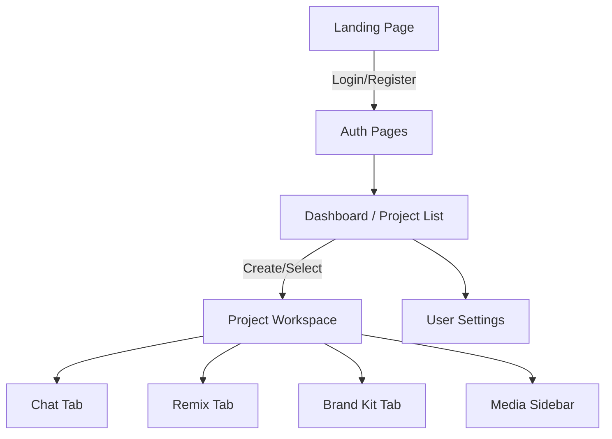
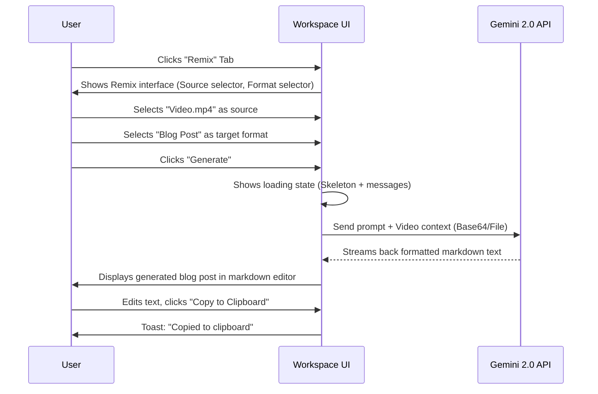

# CreatorForge: UI/UX Design Document

## 1. Design Philosophy

CreatorForge's design philosophy is centered around being modern, clean, and deeply creator-focused. The aesthetic draws heavy inspiration from top-tier productivity and design tools like Figma, Notion, and Linear. The goal is to provide a "flow state" environment where the interface gets out of the way of the content and the AI interaction.

*   **Primary Theme:** Dark theme by default, to reduce eye strain during long creative sessions and make media content (images, videos) pop against dark backgrounds. Light theme is available as an option.
*   **Aesthetic:** Minimalist, high contrast, typography-driven.
*   **Focus:** Content-first. The AI chat and media assets should always be the focal points, not heavy UI chromes.
*   **Tone:** Professional, powerful, intuitive, and "magical" (when AI connects the dots).

## 2. Design System

### Color Palette

**Dark Theme (Default)**
*   **Backgrounds:**
    *   App Background: `#09090b` (Zinc 950)
    *   Surface/Card Background: `#18181b` (Zinc 900)
    *   Elevated Surface (Modals): `#27272a` (Zinc 800)
*   **Text:**
    *   Primary: `#fafafa` (Zinc 50)
    *   Secondary: `#a1a1aa` (Zinc 400)
    *   Muted: `#71717a` (Zinc 500)
*   **Primary Accent (Brand/Action):**
    *   Base: `#8b5cf6` (Violet 500)
    *   Hover: `#7c3aed` (Violet 600)
    *   Active/Pressed: `#6d28d9` (Violet 700)
    *   Light/Subtle: `rgba(139, 92, 246, 0.15)`
*   **Secondary Accent (AI/Magic):**
    *   Base: `#10b981` (Emerald 500) - Used for AI generation highlights or "done" states.
*   **Semantics:**
    *   Success: `#22c55e` (Green 500)
    *   Warning: `#f59e0b` (Amber 500)
    *   Error/Destructive: `#ef4444` (Red 500)
*   **Borders:**
    *   Subtle: `#27272a` (Zinc 800)
    *   Focus Ring: `#8b5cf6` (Violet 500)

**Light Theme**
*   Backgrounds: `#ffffff` (White), `#f4f4f5` (Zinc 100), `#e4e4e7` (Zinc 200)
*   Text: `#09090b` (Zinc 950), `#52525b` (Zinc 600), `#71717a` (Zinc 500)
*   Borders: `#e4e4e7` (Zinc 200)

### Typography

*   **Font Family:** Inter (Primary/UI), JetBrains Mono (Code/Technical context)
*   **Sizes & Weights:**
    *   Display: 48px/56px (Bold 700) - Marketing pages only
    *   H1: 32px/40px (Bold 700) - Page titles
    *   H2: 24px/32px (Semibold 600) - Section headers
    *   H3: 20px/28px (Medium 500) - Card titles
    *   Body Large: 16px/24px (Regular 400) - Primary reading text
    *   Body Small: 14px/20px (Regular 400) - UI text, labels
    *   Caption: 12px/16px (Regular 400) - Metadata, subtle hints

### Spacing Scale (4px Grid)

*   `0.5` (2px), `1` (4px), `2` (8px), `3` (12px), `4` (16px), `5` (20px), `6` (24px), `8` (32px), `10` (40px), `12` (48px), `16` (64px)

### Border Radius & Shadows

*   **Radius:**
    *   Small (Buttons, Inputs): `4px` (`rounded-sm`)
    *   Medium (Cards, Images): `8px` (`rounded-md`)
    *   Large (Modals, Large Cards): `12px` (`rounded-lg`)
    *   Full (Avatars, Badges): `9999px` (`rounded-full`)
*   **Shadows (Dark Theme):**
    *   Subtle/Card: `0 4px 6px -1px rgba(0, 0, 0, 0.5)`
    *   Modal/Floating: `0 20px 25px -5px rgba(0, 0, 0, 0.7)`

### Tailwind CSS Theme Config

```javascript
// tailwind.config.js
/** @type {import('tailwindcss').Config} */
export default {
  content: [
    "./index.html",
    "./src/**/*.{js,ts,jsx,tsx}",
  ],
  darkMode: 'class', // Enable class-based dark mode
  theme: {
    extend: {
      fontFamily: {
        sans: ['Inter', 'sans-serif'],
        mono: ['JetBrains Mono', 'monospace'],
      },
      colors: {
        background: 'var(--background)',
        foreground: 'var(--foreground)',
        card: {
          DEFAULT: 'var(--card)',
          foreground: 'var(--card-foreground)',
        },
        primary: {
          DEFAULT: '#8b5cf6', // Violet 500
          hover: '#7c3aed',
          foreground: '#fafafa',
        },
        secondary: {
          DEFAULT: '#27272a', // Zinc 800
          hover: '#3f3f46',
          foreground: '#fafafa',
        },
        accent: {
          DEFAULT: '#10b981', // Emerald 500
          foreground: '#ffffff',
        },
        destructive: {
          DEFAULT: '#ef4444', // Red 500
          foreground: '#fafafa',
        },
        muted: {
          DEFAULT: '#27272a', // Zinc 800
          foreground: '#a1a1aa', // Zinc 400
        },
        border: 'var(--border)',
        input: 'var(--input)',
        ring: '#8b5cf6',
      },
      borderRadius: {
        sm: '4px',
        md: '8px',
        lg: '12px',
        full: '9999px',
      }
    },
  },
  plugins: [
    require('@tailwindcss/forms'),
  ],
}
```

## 3. Component Library

### Primary Button
*   **Visual:** Solid background, rounded corners, centered text.
*   **Tailwind:** `inline-flex items-center justify-center rounded-md text-sm font-medium transition-colors focus-visible:outline-none focus-visible:ring-2 focus-visible:ring-ring disabled:opacity-50 disabled:pointer-events-none bg-primary text-primary-foreground hover:bg-primary-hover h-10 py-2 px-4`
*   **States:**
    *   Hover: Slightly darker background (`hover:bg-primary-hover`).
    *   Active/Focus: Violet ring outside the border (`focus-visible:ring-2`).
    *   Disabled: 50% opacity, no pointer events (`disabled:opacity-50`).
    *   Loading: Replaces text/icon with a spinner, disabled state.

### Secondary Button
*   **Tailwind:** `... bg-secondary text-secondary-foreground hover:bg-secondary-hover border border-border ...`

### Input Field
*   **Visual:** Dark background, subtle border, lighter text on focus.
*   **Tailwind:** `flex h-10 w-full rounded-md border border-input bg-background px-3 py-2 text-sm ring-offset-background file:border-0 file:bg-transparent file:text-sm file:font-medium placeholder:text-muted-foreground focus-visible:outline-none focus-visible:ring-2 focus-visible:ring-ring disabled:cursor-not-allowed disabled:opacity-50`

### TextArea
*   **Tailwind:** `flex min-h-[80px] w-full rounded-md border border-input bg-background px-3 py-2 text-sm ring-offset-background placeholder:text-muted-foreground focus-visible:outline-none focus-visible:ring-2 focus-visible:ring-ring disabled:cursor-not-allowed disabled:opacity-50 resize-y`

### Card
*   **Visual:** Slightly elevated surface to group related content.
*   **Tailwind:** `rounded-lg border border-border bg-card text-card-foreground shadow-sm`

### File Upload Zone
*   **Visual:** Dashed border area, icon in center, instructions text. Highlighted on drag over.
*   **Tailwind:** `border-2 border-dashed border-muted-foreground/25 hover:border-primary/50 transition-colors rounded-lg flex flex-col items-center justify-center p-8 bg-muted/10 cursor-pointer`
*   **Active (Drag Over):** `border-primary bg-primary/5`

### Chat Bubble
*   **User:** Right-aligned, primary color background.
    *   Tailwind: `ml-auto bg-primary text-primary-foreground rounded-t-lg rounded-bl-lg px-4 py-2 max-w-[80%]`
*   **AI:** Left-aligned, secondary/card background.
    *   Tailwind: `mr-auto bg-card border border-border text-foreground rounded-t-lg rounded-br-lg px-4 py-2 max-w-[80%] shadow-sm`

### Badge
*   **Tailwind:** `inline-flex items-center rounded-full border px-2.5 py-0.5 text-xs font-semibold transition-colors focus:outline-none focus:ring-2 focus:ring-ring focus:ring-offset-2` (Modifiers for variants like `bg-primary/10 text-primary border-primary/20`).

### Skeleton Loader
*   **Tailwind:** `animate-pulse rounded-md bg-muted`

## 4. Page Layouts

### Dashboard (Projects List)
**Layout:**
```text
+-------------------------------------------------------------+
| [Logo]                           [Search] [New Project] [U] |
+-------------------------------------------------------------+
|                                                             |
|  Projects (4)                                               |
|                                                             |
|  +-------------+  +-------------+  +-------------+          |
|  |             |  |             |  |             |          |
|  |  Summer     |  |  Q3 Launch  |  |  Podcast    |          |
|  |  Campaign   |  |  Video      |  |  Ep 14      |          |
|  |             |  |             |  |             |          |
|  | 3 files     |  | 12 files    |  | 2 files     |          |
|  +-------------+  +-------------+  +-------------+          |
|                                                             |
+-------------------------------------------------------------+
```
*   **Responsive:**
    *   Mobile: 1 column grid for cards. Top nav collapses to hamburger menu.
    *   Tablet: 2 column grid.
    *   Desktop: 3 or 4 column grid.

### Workspace (Inside a Project)
**Layout:**
```text
+-------------------------------------------------------------+
| < Back | Project: Summer Campaign    [Share] [Settings] [U] |
+-------------------------+-----------------------------------+
|                         |                                   |
|  [ Media Files ] (3)    |  [ Tabs: Chat | Remix | Brand ]   |
|                         |                                   |
|  +-------+ +-------+    |  AI: I see you uploaded a video   |
|  |       | |       |    |  and a brand guideline PDF.       |
|  | Vid 1 | | Pic 1 |    |  What would you like to make?     |
|  +-------+ +-------+    |                                   |
|                         |                                   |
|  +-------+              |  You: Give me 3 TikTok captions   |
|  |       |              |  based on the video, using our    |
|  | PDF 1 |              |  brand voice.                     |
|  +-------+              |                                   |
|                         |  +-----------------------------+  |
|  [+ Add File Zone]      |  | Type a message...      [^]  |  |
|                         |  +-----------------------------+  |
+-------------------------+-----------------------------------+
```
*   **Responsive:**
    *   Desktop (above): Split screen. Left sidebar (30%) for media, Right main area (70%) for active tab (Chat/Remix/Brand).
    *   Tablet/Mobile: Stacked. Media files form a horizontal scrolling list at the top, or are tucked into a drawer/modal. The Chat/Remix area takes full width.

## 5. Navigation & Information Architecture

### Site Map



*   **Breadcrumbs:** Essential in the workspace view: `Dashboard > Project Name`.
*   **Navigation Pattern:** Top App Bar for global actions (User profile, creating new root items). Tabs within the workspace for contextual tools.

## 6. User Flows

### Content Remixing Flow



## 7. Interaction Design

*   **Drag-and-Drop:** When dragging files into the Workspace, a full-screen or sidebar overlay appears with a dashed border indicating "Drop files here to upload".
*   **Chat Typing Indicator:** When AI is processing, show a subtle `...` pulsing animation (3 dots scaling up and down sequentially) inside an AI chat bubble.
*   **Smooth Transitions:** Switching between Chat, Remix, and Brand Kit tabs should have a subtle fade-in transition (`transition-opacity duration-200 ease-in-out`).
*   **Toast Notifications:** Used for transient success/error states (e.g., "File uploaded", "Project created", "Failed to generate"). Slide in from the bottom-right corner.

## 8. Responsive Design Strategy

*   **Mobile-First Approach:** Start by designing the single-column stacked view.
*   **Breakpoints (Tailwind standard):**
    *   `sm` (640px): Adjust padding, text sizes.
    *   `md` (768px): Transition from stacked workspace to side-by-side (Media | Chat).
    *   `lg` (1024px): Full desktop experience, complex grids.
*   **Touch Targets:** Minimum `44px` by `44px` for all clickable elements (buttons, file items, links) on mobile to ensure tap precision.

## 9. Accessibility Considerations

*   **Color Contrast:** Ensure all text against background passes WCAG AA rating (at least 4.5:1 for normal text). The dark theme palette chosen strictly adheres to this (e.g., Zinc 50 text on Zinc 950 background).
*   **Focus Indicators:** Global focus ring applied to all interactive elements (`focus-visible:ring-2 focus-visible:ring-ring focus-visible:ring-offset-2`).
*   **Keyboard Navigation:** Entire app must be navigable via Tab/Shift-Tab. Modals trap focus until closed.
*   **ARIA:** Use `aria-label` for icon-only buttons (like the send message button or file delete button). Use `role="status"` or `aria-live="polite"` for loading states and toast notifications.

## 10. Animations & Micro-interactions

*   **Button Hover:** Subtle translation (`-translate-y-[1px]`) and color change.
*   **AI Generation:** When text is streaming in from Gemini, don't just flash it. Allow the markdown to render chunk by chunk, simulating a typing effect.
*   **Modals:** Animate in with a slight scale up and fade (`animate-in fade-in zoom-in-95`).
*   **File Upload Progress:** A smooth, growing progress bar at the bottom of the file card.

## 11. Empty States & Error States

*   **No Projects (Dashboard):** Large, friendly illustration. Clear call to action: "Create your first project". Text: "Your creative hub awaits. Start by creating a project to organize your media and ideas."
*   **No Media (Workspace):** The media sidebar shows a large drop zone. Text: "Drop files here to start. Images, audio, video, PDFs, or text."
*   **API Error:** Show a red toast notification. In chat, render an error bubble: "⚠️ Oops, the AI encountered a snag while processing that. Please try again."
*   **File Too Large:** Client-side validation before upload. Immediate error text below the drop zone: "File exceeds 10MB limit (Hackathon constraint)."

## 12. Dark Theme & Light Theme Mappings

*(Implemented via CSS variables in global.css and mapped in Tailwind config)*

```css
/* global.css */
@tailwind base;
@tailwind components;
@tailwind utilities;

@layer base {
  :root {
    /* Light Theme Base */
    --background: 0 0% 100%;
    --foreground: 240 10% 3.9%;
    --card: 0 0% 100%;
    --card-foreground: 240 10% 3.9%;
    --border: 240 5.9% 90%;
    --input: 240 5.9% 90%;
  }

  .dark {
    /* Dark Theme Base (Zinc-based) */
    --background: 240 10% 3.9%; /* zinc-950 roughly */
    --foreground: 0 0% 98%;
    --card: 240 5.2% 11%;     /* zinc-900 roughly */
    --card-foreground: 0 0% 98%;
    --border: 240 3.7% 15.9%;
    --input: 240 3.7% 15.9%;
  }
}

body {
  @apply bg-background text-foreground antialiased;
}
```
*Note: The user relies on `.dark` class on the `<html>` or `<body>` tag to toggle modes.*
